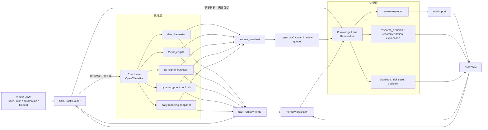
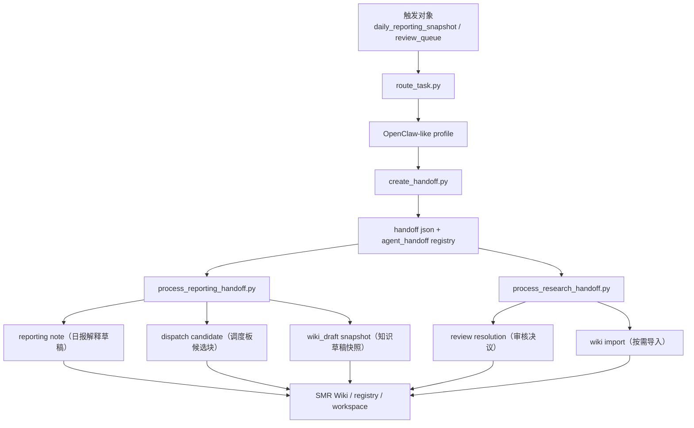
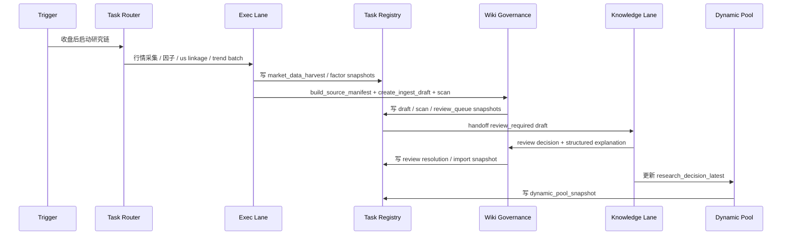
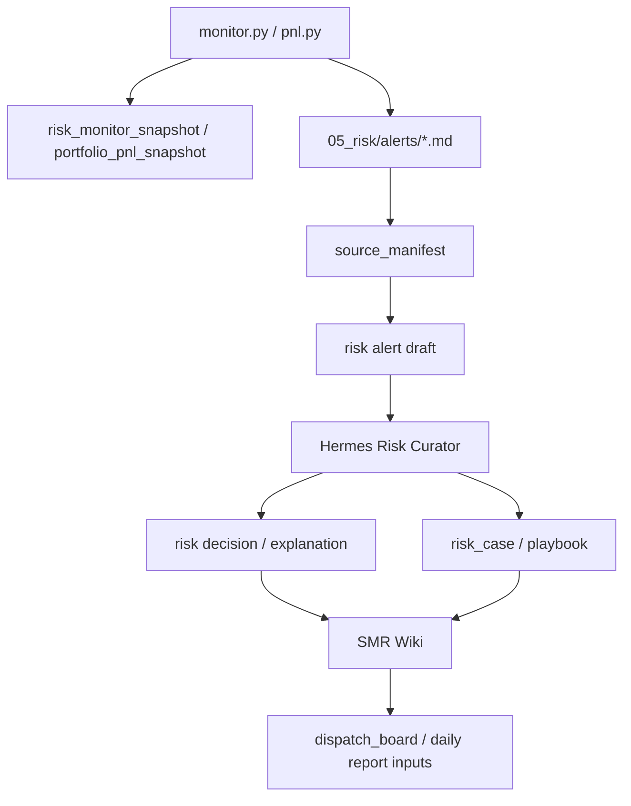
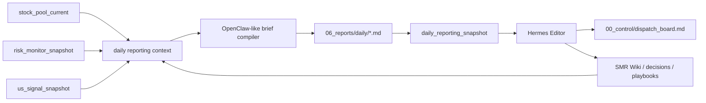

# SMR 双 Agent 落地方案

## 先给结论

你的判断是对的。

更合适的路线不是：

- 直接把原版 `OpenClaw` 和 `Hermes` 当成生产壳硬装进来
- 也不是完全脱离原版，从零重造一个大而全平台

更合适的路线是：

1. 保留当前 `Python + SQLite + Markdown + task registry + wiki governance` 底座。
2. 把 `OpenClaw` 和 `Hermes` 的官方仓库源码当成母版认真学习。
3. 在原版结构和原始代码的基础上，做一层贴合 SMR 业务的定制适配。
4. 执行层直接借 `OpenClaw` 的强项：
   - 任务路由
   - session / workspace 隔离
   - subagent / background task
   - heartbeat / cron / 稳定任务编排
5. 知识层直接借 `Hermes` 的强项：
   - LLM Wiki
   - 记忆沉淀
   - delegation
   - skills progressive disclosure
   - draft / review / import 治理
6. 第一阶段先做 `SMR Agent Runtime` 适配层，把上游能力接到当前 SMR 主链里，后面再决定是否把原版某些模块真正跑起来。

一句话版本：

- 不直接硬装原版产品壳
- 也不闭门自研
- 以上游源码为母版，做 SMR 定制适配

---

## 先确认上游基线

截至 2026-04-13，我这边已经同时完成两件事。

### 1. 官方入口已核对

- OpenClaw 官方仓库：
  - [openclaw/openclaw](https://github.com/openclaw/openclaw)
  - 官方 README：
    - [README.md](https://raw.githubusercontent.com/openclaw/openclaw/main/README.md)
- Hermes 官方仓库：
  - [NousResearch/hermes-agent](https://github.com/NousResearch/hermes-agent)
  - 官方站点：
    - [Hermes Agent](https://hermes-agent.nousresearch.com/)
  - 官方 README：
    - [README.md](https://raw.githubusercontent.com/NousResearch/hermes-agent/main/README.md)

### 2. 本地参考源码已拉下

- `OpenClaw`：
  - `/Users/tianmochen/Documents/二级市场项目开发/同行资本二级市场/12_agent_references/openclaw`
- `Hermes Agent`：
  - `/Users/tianmochen/Documents/二级市场项目开发/同行资本二级市场/12_agent_references/hermes-agent`

后续关于双 agent 的设计，不再只停留在 README 和官网层面，而是以上面这两份本地源码为基线继续推进。

---

## 两个原版项目，各自适合借什么

### OpenClaw 更像执行与接入平台

我这次从源码里确认到的重点是：

- 顶层是 Node / pnpm 大型 monorepo
  - 根目录有 `apps / docs / extensions / packages / skills / src / ui`
- `channel -> agent -> workspace -> session` 是硬路由，不是模型临场决定
  - 关键参考：
    - `docs/channels/channel-routing.md`
    - `src/routing/resolve-route.ts`
- 一个 `agentId` 本质上就是一套隔离的 workspace 和 session store
- skill 有明确的目录优先级和 allowlist
  - 关键参考：
    - `docs/tools/skills.md`
- subagent / ACP spawn 把“后台执行、线程绑定、完成后回传”这套协议做得很细
  - 关键参考：
    - `docs/tools/subagents.md`
    - `src/agents/acp-spawn.ts`

一句话理解：

- OpenClaw 更适合给我们提供“稳定执行、清晰路由、任务编排、隔离运行”的骨架

### Hermes 更像知识、记忆、学习型 agent OS

我这次从源码里确认到的重点是：

- 核心骨架是 `AIAgent + gateway + cron + memory + skills + delegation`
  - 关键参考：
    - `website/docs/developer-guide/architecture.md`
- 记忆不是随便往 prompt 塞，而是有容量上限、有分层、有工具治理
  - 关键参考：
    - `agent/memory_manager.py`
    - `website/docs/user-guide/features/memory.md`
- skill 不是一坨大 prompt，而是 progressive disclosure，按需加载
  - 关键参考：
    - `website/docs/user-guide/features/skills.md`
- 子 agent 委派强调 fresh context、明确 goal/context、限制工具集
  - 关键参考：
    - `website/docs/user-guide/features/delegation.md`
- README 明确带 `hermes claw migrate`
  - 这意味着它本身就承认“OpenClaw 路线和 Hermes 路线是可以衔接的”

一句话理解：

- Hermes 更适合给我们提供“知识沉淀、记忆投影、review 治理、子 agent 协作”的骨架

---

## 为什么现在不建议直接把原版跑成生产

### 1. 当前仓库已经有自己的业务执行底座

SMR 现在不是空白项目，已经有：

- 数据采集脚本
- 因子脚本
- 动态池重建
- 风控检查
- PnL 更新
- source manifest / ingest draft / review / import
- task registry

也就是说，真正缺的是“任务分发和知识协作层”，不是再上一个完整外部产品壳。

### 2. 现有 OpenClaw 部署草稿明显绑死旧环境

当前仓库里的历史脚本：

- [smr_phase0_openclaw.py](/Users/tianmochen/Documents/二级市场项目开发/同行资本二级市场/08_scripts/_deploy_scripts/smr_phase0_openclaw.py)
- [deploy_cron.py](/Users/tianmochen/Documents/二级市场项目开发/同行资本二级市场/08_scripts/_deploy_scripts/deploy_cron.py)

都写死了：

- `/Users/apple/.openclaw/...`
- `/Users/apple/Documents/同行资本二级市场/...`

这说明它们是旧机器上的部署草稿，不是今天这台机器能直接拿来启动的生产运行时。

### 3. 原版产品壳比 SMR 当前需要的更重

如果现在直接把原版整个跑起来，短期会先被这些事情拖住：

- OpenClaw 的多渠道网关、Node runtime、UI、插件壳
- Hermes 的完整 CLI、gateway、provider 配置、cron、plugin / memory provider 装配
- 两边的模型、账号、路径、权限、安全策略收口

这会把当前重心从“SMR 业务落地”拖回“通用平台部署”。

### 4. 但完全脱离原版自己重写，也不对

从参考项目里值得学的，不是照抄产品壳，而是照抄这几个原则：

- knowledge 不能每次从零开始
- task 必须 append-only 留痕
- handoff 不能只靠对话，必须靠结构化对象
- active handoff 要跟着同一 `entity_type + entity_id` 的最新快照走，不能永久绑死第一次生成时的 `source_entry_id`
- 子 agent 需要 fresh context 和受限工具集
- 高判断对象必须进入治理闭环

这里补一条我们在本项目里已经落地的约束：

- `pending / accepted` 状态的 handoff（仍在流转中的交接单），如果同一个实体后来生成了更新快照，就要自动把 handoff 绑定刷新到最新 `source_entry_id`
- 这样研究说明稿、日报解释稿、dispatch sync（调度同步）和后续 shadow / review（影子执行 / 审核）看到的是同一版事实，而不是旧快照残影
- `completed / cancelled` 的 handoff 仍保留当时留痕，不回写历史

所以结论不是“不看原版”，而是：

- 不直接把原版当生产壳
- 但必须以原版源码为母版做定制适配

---

## 我们应该直接借什么

### 直接借 OpenClaw 的 4 个东西

1. `Task Router`
   - 把任务按规则分流到不同 agent lane
2. `Workspace + Session Isolation`
   - 不同 lane / profile 有自己的 workspace、skills、session
3. `Subagent / Background Task Contract`
   - 后台跑、结束回传、必要时线程绑定
4. `Heartbeat / Cron Discipline`
   - 稳定任务自动触发、自动记录、自动补心跳

### 直接借 Hermes 的 5 个东西

1. `Memory Projection`
   - 从 registry / wiki / research 投影出长期可复用记忆
2. `Skills Progressive Disclosure`
   - 不把所有知识一次性塞满 prompt
3. `Delegation Contract`
   - goal / context / toolset / outputs 要明确
4. `Governance Loop`
   - draft / review / resolution / import
5. `Learning Loop`
   - 用复盘去修 thesis、playbook、决策规则

---

## 目标架构



---

## 当前已经跑通的最小落地链路

这部分不是设想，是已经在本地目录里跑起来的最小版本。



当前已经落地并验证过的具体对象：

- 路由脚本：
  - `08_scripts/agents/route_task.py`
- handoff 脚本：
  - `08_scripts/agents/create_handoff.py`
  - `08_scripts/agents/list_handoffs.py`
  - `08_scripts/agents/resolve_handoff.py`
- 研究治理处理：
  - `08_scripts/agents/process_research_handoff.py`
- 研究上下文处理：
  - `08_scripts/agents/process_research_context_handoff.py`
- 日报治理处理：
  - `08_scripts/agents/process_reporting_handoff.py`
- reporting 同步处理：
  - `08_scripts/agents/process_reporting_sync_handoff.py`
- 风险治理处理：
  - `08_scripts/agents/process_risk_handoff.py`
- 调度包汇总：
  - `08_scripts/agents/build_dispatch_packet_candidate.py`
- 调度板写回候选：
  - `08_scripts/agents/build_dispatch_board_patch_candidate.py`
- 调度板正式写回：
  - `08_scripts/agents/apply_dispatch_board_patch_candidate.py`
- 共享 helper：
  - `08_scripts/lib/smr_agents.py`

当前已经验证通过的行为边界：

- `daily_reporting_snapshot` 可以自动 handoff 给 `hermes_reporting_editor`
- `dynamic_pool_snapshot`、`trend_research_batch`、`research_quality_snapshot` 可以自动 handoff 给 `hermes_research_curator`
- `review_queue` 可以自动 handoff 给 `hermes_research_curator`
- `research_context_note` 可以继续自动 handoff 给 `hermes_reporting_editor`
- `risk_monitor_snapshot`、`portfolio_pnl_snapshot` 在没有真实风险信号时会自动跳过 handoff
- `risk_update_candidate` 可以继续自动 handoff 给 `hermes_reporting_editor`
- 日报处理会生成解释草稿和调度板候选块，但不会直接覆盖正式调度板
- 研究上下文处理会生成解释草稿，但不会直接把上下文快照写成正式知识
- 研究处理支持批量挑 draft，但不会默认自动批准真实研究草稿
- 风险处理会生成解释草稿和治理候选块，但不会直接改仓位或风控真相
- reporting sync 会把研究/风险候选进一步压成可并入调度板的同步块
- 调度包汇总会把日报候选和同步块合并成单日 packet，但仍然停留在候选层
- 同一日报的 `dispatch_update_candidate` 在 packet 里只保留最新一版，不继续混入旧交接单
- `dispatch_sync_candidate` 在 packet 里按上游业务源类型收敛，只保留每类最新上下文，避免同类历史重跑块反复堆叠
- 调度板写回会基于 packet 生成 review-only patch 和预览版，但不会直接覆盖正式调度板
- 调度板正式写回只在确认后执行，并带备份与 registry 留痕
- 批量研究治理按单 draft savepoint 执行，单条失败不拖垮整批

这意味着双 agent 现在已经不是“纸面架构”，而是已经有一条可运行、可留痕、可回放、可继续扩展的最小主干。

---

## 两条 lane 具体怎么分

## 类 OpenClaw lane

### 负责什么

- 数据采集
- us signal 检测
- 因子计算
- 趋势批量研究生成
- 动态池重建
- PnL 更新
- 风控巡检
- 日报表面快照
- source manifest / draft scan / review queue

### 输出什么

- 数据表更新
- Markdown 快照
- task registry entry
- wiki draft
- review queue

### 不该做什么

- 不直接写正式 wiki
- 不直接给 thesis 定版
- 不直接覆盖 recommendation 解释
- 不直接跳过风控门禁

## 类 Hermes lane

### 负责什么

- 行业主线解释
- 个股 thesis 修正
- recommendation 升降级说明
- risk case 沉淀
- playbook 编译
- draft 审核
- decision 页面维护
- 知识页 merge / import 决策

### 输出什么

- 结构化研究结论
- review decision
- reason code
- wiki 正式页
- decision / playbook / risk case

### 不该做什么

- 不直接改底层行情数据
- 不直接绕过 `entry.py` 和 `monitor.py`
- 不直接把主观看法写成交易执行

---

## handoff 契约怎么设计

双 agent 能不能跑顺，关键不在“谁更聪明”，关键在 handoff 对象是不是稳定。

当前建议 handoff 的标准对象统一长这样：

```json
{
  "handoff_id": "handoff_xxx",
  "lane": "openclaw_to_hermes",
  "handoff_type": "research_review",
  "status": "pending",
  "source_task_id": "registry_xxx",
  "entity_type": "wiki_draft",
  "entity_id": "draft__stock_research__300502_sz_2026-04-10_deep_research",
  "required_action": "review_and_explain",
  "inputs": {
    "registry_entry_ids": ["registry_xxx", "registry_yyy"],
    "source_paths": ["02_research/...", "03_stock_pool/..."],
    "blocking_reason_codes": ["duplicate_thesis"]
  },
  "expected_outputs": {
    "review_decision": true,
    "reason_code": true,
    "wiki_import_ready": false,
    "decision_page": true
  },
  "created_at": "2026-04-13 16:00:00"
}
```

### 这里最重要的 4 个字段

1. `entity_type + entity_id`
   - 明确这次交接到底是围绕哪个业务对象
2. `required_action`
   - 明确对方要干什么，不让 handoff 变成一句空话
3. `inputs`
   - 把上游证据路径和 registry id 给全
4. `expected_outputs`
   - 把产出契约写死，便于校验

---

## 业务链路怎么跑

### 链路 A：趋势驱动研究



### 链路 B：风险与复盘



### 链路 C：日报与调度



---

## 本地落地路线

### 方案 A：直接装原版 OpenClaw + 原版 Hermes

### 优点

- 名字和概念完全一致
- 理论上最接近历史设计

### 缺点

- 先要解决完整 runtime、配置、模型、账号、路径、权限
- 会把当前项目从“业务施工”拉回“平台部署”
- 很多通用能力暂时用不上，但要先一起背复杂度

### 结论

不建议作为当前第一阶段方案。

### 方案 B：完全自己从零重造一个大而全平台

### 优点

- 最自由

### 缺点

- 容易过度工程化
- 会重走 OpenClaw / Hermes 已经踩过的坑
- 很容易做得既不像原版，也不如原版稳

### 结论

也不建议。

### 方案 C：以上游原版源码为母版，做 `SMR Agent Runtime` 定制适配层

### 这套方案的关键点

- 上游结构直接参考本地 `12_agent_references/`
- 执行层直接借 OpenClaw 的 route / session / workspace / subagent 思路
- 知识层直接借 Hermes 的 memory / skills / delegation / cron 思路
- registry 当 handoff 总线
- wiki governance 当知识门禁
- 继续沿用当前 Python / SQLite / Markdown

### 结论

这是当前最推荐的方案。

---

## 推荐施工顺序

### Phase 1：先做最小适配层，不碰外部平台壳

建议新增：

- `08_scripts/agents/route_task.py`
- `08_scripts/agents/create_handoff.py`
- `08_scripts/agents/list_handoffs.py`
- `08_scripts/agents/resolve_handoff.py`
- `12_smr_agents/profiles/`
- `12_smr_agents/handoffs/`

这一阶段只解决：

- 任务如何分 lane
- handoff 如何落地
- registry 如何挂接
- agent profile 如何映射到 OpenClaw 风格的 workspace / skill allowlist
- knowledge profile 如何映射到 Hermes 风格的 memory / delegation / review

### Phase 2：把 3 条业务链真正跑通

先接：

1. 趋势驱动研究链
2. 风险复盘链
3. 日报 / dispatch 链

### Phase 3：再补长期记忆投影

这一阶段新增：

- 研究主线 memory
- recommendation memory
- risk playbook memory
- dispatch planning memory

### Phase 4：最后再考虑更深的原版兼容或局部运行

如果后面确实需要：

- cron job 配置兼容
- workspace 目录兼容
- prompt-pack 兼容
- 某些上游 runtime 的局部嵌入

再做 adapter。

不是现在先去装原版。

---

## 这轮施工后，双 agent 已经具备的前提

当前 SMR 已经有 3 个关键前提了：

1. `task_registry_entry`
   - 已经能承接任务快照
2. `SMR Wiki governance`
   - 已经能承接高判断对象治理
3. `daily / risk / pool / research` 这几段状态都能落成结构化快照

这意味着下一步做双 agent，不需要再从“日志 + 对话”开始，而是可以直接从：

- registry entry
- wiki draft
- review queue
- risk snapshot
- daily reporting snapshot

这些稳定对象开始。

---

## 最后一句判断

如果你问“我们是直接把 OpenClaw 和 Hermes 在本地跑起来，还是照着它们的原版代码做定制版本？”

我的结论是：

- **短期答案**：以上游原版源码为母版，先做 SMR 定制适配层
- **中期答案**：保留 OpenClaw 风格的调度 / workspace / handoff 兼容面，保留 Hermes 风格的 memory / skill / delegation 兼容面
- **长期答案**：如果适配层稳定，再决定是否把原版某些模块真正跑起来，或者做更深的兼容

这样做的好处是：

- 不会被旧环境绑死
- 不会因为平台壳过重先拖慢业务施工
- 不会闭门从零造轮子
- 能直接贴着 SMR 现有主链长出来
- 能把 LLM Wiki、registry、review governance 这些已经做出来的资产真正用起来
