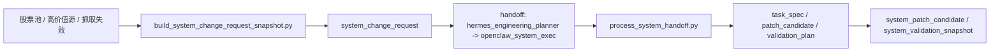
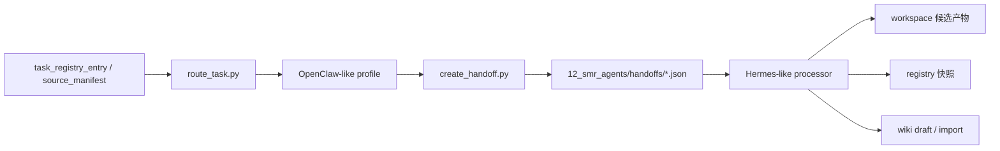

# SMR Agent Runtime

## 目录作用

这个目录是 SMR 当前项目的最小 agent runtime 适配层。

它不是原版 `OpenClaw` 或 `Hermes` 的运行目录。
它的作用是：

- 把上游项目里真正值得借的路由、profile、handoff、workspace 思想，落成 SMR 本地可运行对象

---

## 子目录说明

### `profiles/`

放 agent profile 定义。

每个 profile 至少说明：

- 自己属于哪条 lane
- 默认处理哪些 `entity_type`
- 默认工作目录在哪里
- 默认工具能力是什么
- 产物更适合 handoff 给谁

### `handoffs/`

放结构化 handoff 对象。

每个 handoff 文件都应该至少有：

- 来源 profile
- 目标 profile
- 关联的 registry entry
- 当前状态
- required action
- history

### `workspaces/`

给不同 profile 预留稳定工作目录。

当前阶段先把路径固定下来，后面再决定要不要补：

- prompt pack
- memory projection
- review/export 缓存
- profile 级技能包

当前已经实际使用的子目录包括：

- `workspaces/hermes_research_curator/notes/`
  - 放动态池、研究质量、美股信号这类研究上下文解释草稿
- `workspaces/hermes_research_curator/model_packets/`
  - 放研究类 handoff 生成的模型任务包
- `workspaces/hermes_research_curator/shadow_runs/`
  - 放研究类模型任务包编译后的影子执行输入与结果
  - 当前会落 `compiled_prompt.md / request.json / response.json / response_text.md / result.md`
- `workspaces/hermes_reporting_editor/notes/`
  - 放日报解释草稿
- `workspaces/hermes_reporting_editor/dispatch_updates/`
  - 放调度板更新候选块
- `workspaces/hermes_reporting_editor/dispatch_packets/`
  - 放日报 / 研究 / 风险候选块汇总后的调度包候选
- `workspaces/hermes_reporting_editor/dispatch_patches/`
  - 放面向正式 `dispatch_board.md` 的审阅式写回候选
- `workspaces/hermes_risk_curator/notes/`
  - 放风险解释草稿
- `workspaces/hermes_risk_curator/risk_updates/`
  - 放风险治理候选块
- `workspaces/hermes_risk_curator/model_packets/`
  - 放风险类 handoff 生成的模型任务包
- `workspaces/hermes_risk_curator/shadow_runs/`
  - 放风险类模型任务包编译后的影子执行输入与结果
  - 当前会落 `compiled_prompt.md / request.json / response.json / response_text.md / result.md`
- 后续其他 profile 也按同样思路，把“候选产物”和“正式真相”分开

### `prompt_packs/`

放 Hermes-like profile 的固定提示包。

当前这些文件只是“模型态接入前”的标准提示模板，不代表已经启用真实模型调用：

- `prompt_packs/hermes_research_curator.md`
- `prompt_packs/hermes_risk_curator.md`
- `prompt_packs/hermes_reporting_editor.md`

### `model_runtime/`

放模型接入配置。

当前已经有：

- `model_profiles.json`
- `task_routes.json`

当前已经有对应脚本：

- `08_scripts/agents/build_model_task_packet.py`
- `08_scripts/agents/run_model_shadow.py`

当前模型层已经切到：

- `global_mode = shadow`
- 原 OpenAI 槽位由 `minimax/MiniMax-M2.7` 承接
- Anthropic 复核槽位继续由 Anthropic 承接

也就是说，当前运行时允许发起真实 shadow 请求，但仍然只写候选层和执行留痕。

补充说明：

- `run_model_shadow.py`
  - 现在已经支持在满足门禁时发起真实 `OpenAI Responses API`（OpenAI 响应接口）shadow 请求
  - 也已经支持 `Anthropic Messages API`（Anthropic 消息接口）shadow 请求
  - 截至 2026-04-14，`OpenAI` 已在当前机器上完成 live smoke（实时冒烟）验证，确认第三方中转需要走 `/responses + text/event-stream`（事件流）
  - 当前失败留痕会写出 `provider_error_code / provider_error_reason`
  - 截至 2026-04-14，`Anthropic` 代码接线已完成，但 `api.ailinkmax.com/v1` 这组入口仍未验证通过
  - 当前正式配置是 `global_mode = shadow`
  - 所以进入模型路由的任务会在满足门禁时发起真实 shadow 请求
  - shadow 输出仍然只进入 `shadow_runs/` 与候选层，不直接写正式真相层
  - `OpenAI` 在 shell 缺少环境变量时，会尝试回退读取本机 `~/.codex/auth.json + ~/.codex/config.toml`
  - 因此像 `trend_research_batch -> google` 这类路由，当前还不能作为第一批真实 shadow 链路
- 运行时 override（覆盖层）
  - 可通过 `SMR_MODEL_PROFILES_PATH / SMR_TASK_ROUTES_PATH` 临时替换运行时配置
  - 这样可以做受控灰度，不必修改仓内正式 `model_profiles.json / task_routes.json`
- `run_openai_p1_shadow_canary.py`
  - 是当前推荐的 P1 真实灰度入口
  - 默认只放行：
    - `risk_monitor_snapshot`
    - `us_signal_snapshot`
    - `daily_reporting_snapshot`
  - 自动选样本时，会优先挑 source docs（源文档）更完整的已完成 handoff
  - 其余 `entity_type` 会被临时改成 `disabled_canary`
  - 默认遇到额度耗尽类 `429` 会停止后续 handoff
  - 截至 2026-04-14 实测：
    - 风控链已成功返回 `http_status=200`
    - 日报链返回 `http_status=429 / provider_error_code=USAGE_LIMIT_EXCEEDED / provider_error_reason=DAILY_LIMIT_EXCEEDED`

---

## 当前口径

### OpenClaw-like

偏执行：

- `openclaw_data_exec`
- `openclaw_factor_exec`
- `openclaw_pool_exec`
- `openclaw_risk_exec`
- `openclaw_report_exec`
- `openclaw_system_exec`
  - 承接 `system_change_request`
  - 只生成 `task_specs / patch_candidates / test_runs`
  - 当前不直接自动改真相层代码

### Hermes-like

偏知识治理：

- `hermes_research_curator`
- `hermes_risk_curator`
- `hermes_reporting_editor`
- `hermes_engineering_planner`
  - 负责把业务缺口编译成 `system_change_request`
  - 当前不直接写代码，只负责系统施工任务治理

## 日常运营调度边界

Codex 只作为项目开发、排障和人工维护工具，不参与日常运营班表。

日常运营由项目内 agent runtime 承接：

- 班表注册表：`12_smr_agents/schedules/agent_schedule_registry.json`
- agent 入口：`08_scripts/scheduler/run_agent_schedule.py`
- macOS launchd 部署器：`08_scripts/scheduler/deploy_agent_launchd.py`

每个班表都会声明：

- `lead_profile_id`：牵头岗位
- `operator_profile_ids`：参与执行/治理岗位
- `job_id`：落到统一调度脚本的具体业务链

统一调度脚本 `run_smr_schedule_job.py` 会把这些 agent execution context 写入 `summary.json / run.md`，方便控制塔和审计追踪。

---

## 当前阶段的边界

1. 先把 profile / route / handoff 跑通。
2. 先和现有 `task_registry_entry` 绑定。
3. 先贴着现有 wiki governance 走。
4. 暂时不引入完整消息网关、完整 UI、完整多平台 runtime。
5. 当前先做“可接模型的脚手架”，不做“真实模型全面接管”。

## 当前已接自动链路

- `daily_reporting_snapshot -> hermes_reporting_editor`
- `dynamic_pool_snapshot -> hermes_research_curator`
- `portfolio_action_memo_snapshot -> hermes_research_curator`
- `trend_research_batch -> hermes_research_curator`
- `research_quality_snapshot -> hermes_research_curator`
- `rotation_candidate_snapshot -> hermes_research_curator`
- `rotation_execution_plan_snapshot -> hermes_research_curator`
- `strategy_watch_batch -> hermes_research_curator`
- `review_queue -> hermes_research_curator`
- `us_signal_snapshot -> hermes_research_curator`
  - 仅在出现显著变化时建议 handoff
- `research_context_note -> hermes_reporting_editor`
  - 研究解释草稿会继续流向 reporting 侧，生成调度同步候选
- `risk_monitor_snapshot -> hermes_risk_curator`
  - 仅在存在真实预警时建议 handoff
- `portfolio_pnl_snapshot -> hermes_risk_curator`
  - 仅在持仓存在且亏损结构需要解释时建议 handoff
- `risk_update_candidate -> hermes_reporting_editor`
  - 风险治理候选会继续流向 reporting 侧，生成调度同步候选
- `system_change_request -> openclaw_system_exec`
  - 业务驱动缺口会进入受控工程链，生成任务规格、补丁候选和验证计划

## 当前已接处理入口

- `08_scripts/agents/process_research_handoff.py`
  - 研究治理代理处理 `review_queue / wiki_draft` handoff
  - 支持 `--accept-only`，先领取不审批
  - 支持重复传入 `--draft-id`
  - 支持 `--batch-limit` + `--candidate-category`，从 `review_queue` 批量挑待审核 draft
  - 支持 `approved / rejected / reopened`
  - 支持 `--import-approved`，仅在明确批准后导入 wiki
  - 单条 draft 用 savepoint 隔离，单条失败不会拖垮整批
  - 默认不自动批准真实研究 draft
- `08_scripts/agents/process_research_context_handoff.py`
  - 研究上下文代理处理 `dynamic_pool_snapshot / portfolio_action_memo_snapshot / trend_research_batch / research_quality_snapshot / rotation_candidate_snapshot / rotation_execution_plan_snapshot / stock_objective_monitor_snapshot / strategy_watch_batch / us_signal_snapshot`
  - 生成 `notes/` 下的研究上下文解释草稿
  - 额外注册 `research_context_note` 快照
- `08_scripts/agents/process_reporting_handoff.py`
  - 日报代理处理 `daily_reporting_snapshot` handoff
  - 生成 `notes/` 下的日报解释草稿
  - 生成 `dispatch_updates/` 下的调度板更新候选块
  - 支持 `--refresh-draft`，按 `source_manifest` 刷新 `daily_report` 类知识草稿
  - 只生成候选块，不直接改正式 `00_control/dispatch_board.md`
- `08_scripts/agents/process_reporting_sync_handoff.py`
  - reporting 代理处理 `research_context_note / risk_update_candidate`
  - 生成 `dispatch_updates/` 下的调度同步候选块
  - 额外注册 `dispatch_sync_candidate` 快照
- `08_scripts/agents/process_risk_handoff.py`
  - 风险代理处理 `risk_monitor_snapshot / portfolio_pnl_snapshot`
  - 生成 `notes/` 下的风险解释草稿
  - 生成 `risk_updates/` 下的风险治理候选块
  - 额外注册 `risk_update_candidate` 快照
- `08_scripts/agents/build_dispatch_packet_candidate.py`
  - 按日期汇总 `dispatch_update_candidate + dispatch_sync_candidate`
  - 生成 `dispatch_packets/` 下的调度包候选
  - 额外注册 `dispatch_packet_candidate` 快照
- `08_scripts/agents/build_dispatch_board_patch_candidate.py`
  - 读取正式 `dispatch_board.md` 和最新 `dispatch_packet_candidate`
  - 生成 review-only（仅审阅）调度板 patch（补丁）候选和预览版
  - 额外注册 `dispatch_board_patch_candidate` 快照
- `08_scripts/agents/apply_dispatch_board_patch_candidate.py`
  - 在确认后，把最新调度板 patch 候选安全写回正式 `dispatch_board.md`
  - 会先做备份，再写回，再注册 `dispatch_board_apply_execution` 快照
- `08_scripts/agents/build_system_change_request_snapshot.py`
  - 扫描当前股票池、高价值目标注册表、source_manifest 和最新抓取失败
  - 生成 `system_change_request` 快照
  - 在满足条件时自动创建 `hermes_engineering_planner -> openclaw_system_exec` handoff
- `08_scripts/agents/process_system_handoff.py`
  - system 施工执行代理处理 `system_change_request`
  - 生成 `task_specs/` 下的任务规格
  - 生成 `patch_candidates/` 下的补丁候选
  - 生成 `test_runs/` 下的验证计划和验证留痕占位
  - 额外注册 `system_patch_candidate + system_validation_snapshot`
- `08_scripts/agents/run_codex_cli_shadow.py`
  - 把 `system_change_request` handoff 交给本机 `Codex CLI` 做只读影子执行
  - 只产出 shadow 建议，不直接改代码
  - 结果会落到 `workspaces/openclaw_system_exec/codex_shadow_runs/`
  - 截至 2026-04-17，已完成真实验证，但当前默认不做 inline auto-run（内联自动触发）
  - 原因是本机 `Codex CLI` 在只读分析模式下延迟仍偏高，更适合人工触发、定时批次或后续异步队列

## 业务驱动系统自进化链

截至 2026-04-17，这条链的最小闭环已经实际落地：

当前真实边界：

- 已能自动发现系统缺口，并编译成受控工程任务单
- 已能自动生成补丁候选和验证计划
- 已能把工程任务受控转交给本机 `Codex CLI` 做只读 shadow（影子执行）
- 但当前 `Codex CLI shadow` 默认是手动/批次能力，不放在主业务链里同步等待
- 还不能自动改正式代码
- 还不能自动 commit（提交）或 merge（合并）主线

## 当前已跑通的最小闭环

已经验证通过的两条链路：

- `daily_reporting_snapshot -> openclaw_report_exec -> hermes_reporting_editor`
  - 会生成日报解释草稿
  - 会生成调度板更新候选块
  - 在满足条件时会刷新 `daily_report` 类知识草稿
- `review_queue -> openclaw_report_exec -> hermes_research_curator`
  - 可以先领取 handoff
  - 可以按批次挑出待审核 draft
  - 可以逐条决议并按需导入 wiki
- `dynamic_pool_snapshot / research_quality_snapshot -> openclaw_pool_exec -> hermes_research_curator`
  - 会生成研究上下文解释草稿
  - 会注册 `research_context_note` 快照
- `risk_monitor_snapshot / portfolio_pnl_snapshot -> openclaw_risk_exec -> hermes_risk_curator`
  - 会生成风险解释草稿和风险治理候选块
  - 在没有真实风险信号时会自动跳过建议 handoff
- `research_context_note / risk_update_candidate -> hermes_reporting_editor`
  - 会生成调度同步候选块
- `dispatch_update_candidate + dispatch_sync_candidate -> dispatch_packet_candidate`
  - 会合并成单日调度包候选，供次日任务板使用
- `dispatch_packet_candidate -> dispatch_board_patch_candidate`
  - 会生成正式调度板的审阅式写回候选，但不会直接改正式板子
- `dispatch_board_patch_candidate -> dispatch_board_apply_execution`
  - 经确认后可以安全写回正式调度板，并保留备份和执行留痕

## 当前安全边界

- 高判断对象默认不自动审批。
- 日报链路只生成候选块，不直接覆盖正式调度板。
- 风险和 PnL 链路只生成解释草稿和候选块，不直接改仓位或预警真相。
- 研究 / 风险流向 reporting 后，也只生成调度同步候选块和调度包候选，不直接落正式调度板。
- 调度板写回当前仍然是 patch 候选和预览版，不直接覆盖正式 `dispatch_board.md`。
- 正式写回只通过 `apply_dispatch_board_patch_candidate.py` 执行，并会先备份旧版调度板。
- 没有显著事件的 factor / risk / PnL 快照会自动跳过 handoff，避免噪音。
- 正式知识导入只在明确 `approved` 后执行。
- handoff、draft、dispatch candidate 都要先留痕，再决定是否进入正式真相层。
