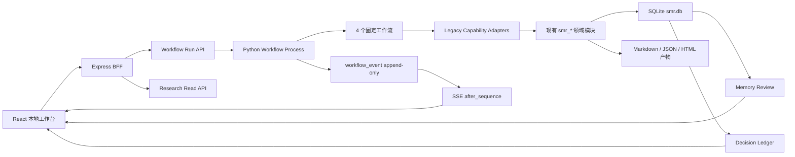

# Personal Research Workbench MVP Implementation Plan

> **For Claude:** REQUIRED SUB-SKILL: Use superpowers:executing-plans to implement this plan task-by-task.

**Goal:** 将现有 SMR 代码库收敛成一套单人、本地优先、可稳定运行的个人投研工作台，并在不丢失现有能力与历史资产的前提下安全修剪 Phase 脚手架、重复模块和生成物。

**Architecture:** 采用模块化单体架构。React 保留为本地交互界面，Express 收敛为轻量 BFF，新增统一 Python 工作流运行时包装现有 `smr_*` 研究能力；SQLite 继续作为唯一运行数据库，Markdown/JSON/HTML 继续承载研究产物。工作流通过 SQLite append-only 事件流向前端提供可恢复的执行进度，不引入 Redis、Kafka、PostgreSQL 或微服务。

**Tech Stack:** Python 3.11+、SQLite、Node.js、Express 5、React 18、TypeScript、Vite、Vitest/Node Test、Python unittest/pytest、SSE、Markdown。

---

## 0. 文档状态

- 状态：Proposed
- 计划日期：2026-07-13
- 适用仓库：`D:\李少博的文件\TH_Capital_二级市场\th_capital_stock`
- 产品边界：单人自用、本地运行、研究辅助、paper-only，不连接券商、不自动交易
- 实施约束：当前工作区有未提交修改，实施必须先建立安全基线，禁止直接批量删除或覆盖用户文件
- 里程碑命名：弃用新的 Phase 编号，改用 `M0`—`M6` 产品里程碑

## 1. 现状基线

### 1.1 已确认资产

- 主 SQLite：`01_data/db/smr.db`，约 312 MB，62 张业务表。
- 现有数据：行情、因子、公告、新闻、证据、估值、基本面、Agent handoff、决策台账、风险告警。
- 前端：React + TypeScript + Vite，目前只有 Dashboard 和个股详情两条主路由。
- API：`api/server.js`，约 15 万字符，7 个主要 GET 接口，业务计算与路由高度耦合。
- 运行调度：`08_scripts/scheduler/run_smr_schedule_job.py` 已提供命名任务、锁和结构化日志，可作为新工作流适配来源。
- Agent：已有 profile、handoff、candidate、人工审核和 dispatch 候选机制。
- 知识层：已有 `research_claims`、`evidence_items`、`claim_evidence_links`、Wiki draft 状态机。

### 1.2 已确认问题

- 171 个 Phase 配置、约 4840 个 Phase Python 文件、1127 个测试文件，运行代码与规格脚手架混杂。
- 70 个 Phase pipeline 中约 56 个主要返回静态契约数据，不应继续处于正式运行路径。
- `risk_alert` 有 8423 行，`critical_repeat` 呈指数式重复放大。
- 68 个数据健康对象中 67 个为 `stale`，状态解释粒度不足。
- `research_index`、`research_decision` 和正式 Wiki 索引尚未形成稳定沉淀。
- 根测试执行 64 项，当前 1 失败、2 报错；前端 TypeScript 依赖不完整，快速校验不可用。
- Git 工作区约有 21 个修改对象、129 个未跟踪对象；存在未跟踪的 refresh token 文件。
- README 仍是 Vite 模板，无法作为运行入口说明。

## 2. 产品范围

### 2.1 MVP 必须完成

1. 从同一个本地页面启动研究工作流。
2. 页面实时显示工作流步骤、日志摘要、错误和产物。
3. 页面刷新或服务重启后，可恢复查看历史运行和已有事件。
4. 提供四条固定工作流：每日简报、个股深挖、Thesis 更新、组合风险复盘。
5. 研究结论能够回溯到证据和数据新鲜度。
6. 系统提出记忆候选，由用户接受、拒绝或归档。
7. 决策记录能关联当时证据、预期、失效条件和后续结果。
8. 日常运行只展示经过聚合和去重的高价值告警。

### 2.2 明确不做

- 多用户、登录、权限、团队协作。
- 订阅、积分、账单、支付。
- 微服务、容器编排、云部署、高可用集群。
- Redis、Kafka、PostgreSQL、向量数据库。
- 券商连接、真实下单、自动仓位操作。
- 通用型自由对话 Agent。
- 无限制并行 Agent 和自动修改正式知识层。
- 新增 Phase 208+ 或继续按 Phase 复制同类 runner。

## 3. 非功能要求

| 类别 | MVP 目标 |
|---|---|
| 用户规模 | 单用户，本机访问 |
| 网络边界 | 默认只绑定 `127.0.0.1` |
| 并发 | 同时最多 1 个写入型工作流，允许多个只读页面 |
| 页面性能 | 首页 2 秒内可交互；普通只读 API p95 < 500ms |
| 事件延迟 | 工作流事件写入后 1 秒内显示 |
| 可恢复性 | 服务重启后运行记录、事件和产物不丢失 |
| 数据恢复 | 每日数据库备份；RPO 24 小时，RTO 2 小时 |
| 可维护性 | 新工作流只新增一个定义模块和测试，不修改中央巨型文件 |
| 安全 | token 不入库、不入日志、不入 Git；所有写操作有显式边界 |
| 可审计性 | 结论、记忆、决策、人工审批都能追溯来源和时间 |

## 4. 目标架构



### 4.1 目标目录

```text
th_capital_stock/
├── api/
│   ├── server.js                    # 仅启动和进程级错误处理，目标 < 100 行
│   ├── app.js                       # Express 组装
│   ├── routes/
│   │   ├── health.js
│   │   ├── research.js
│   │   ├── workflows.js
│   │   ├── artifacts.js
│   │   ├── memories.js
│   │   └── decisions.js
│   ├── services/
│   │   ├── workflow-process.js
│   │   └── event-stream.js
│   └── repositories/
│       ├── research-repository.js
│       └── workflow-repository.js
├── smr_app/
│   ├── __init__.py
│   ├── __main__.py                  # `python -m smr_app`
│   ├── cli.py
│   ├── runtime/
│   │   ├── contracts.py
│   │   ├── registry.py
│   │   ├── runner.py
│   │   ├── event_store.py
│   │   ├── artifact_store.py
│   │   └── cancellation.py
│   ├── workflows/
│   │   ├── daily_brief.py
│   │   ├── stock_deep_dive.py
│   │   ├── thesis_update.py
│   │   └── portfolio_review.py
│   └── adapters/
│       ├── scheduler_jobs.py
│       ├── evidence.py
│       ├── fundamentals.py
│       ├── valuation.py
│       ├── risk.py
│       ├── agents.py
│       └── decisions.py
├── migrations/
├── src/
│   ├── app/
│   ├── features/workflows/
│   ├── features/memories/
│   ├── features/decisions/
│   └── features/research/
├── tests/
│   ├── smoke/
│   ├── runtime/
│   ├── workflows/
│   └── api/
└── legacy_manifest/
    ├── inventory.json
    ├── classifications.csv
    └── removal_log.md
```

现有 `08_scripts/lib` 不立即搬迁。第一版通过 adapter 调用，待工作流稳定后再逐个抽取领域模块。

## 5. 数据模型 SPEC

### 5.1 新增表

```sql
CREATE TABLE schema_migrations (
    version TEXT PRIMARY KEY,
    applied_at TEXT NOT NULL DEFAULT CURRENT_TIMESTAMP
);

CREATE TABLE workflow_runs (
    run_id TEXT PRIMARY KEY,
    workflow_id TEXT NOT NULL,
    status TEXT NOT NULL CHECK (
        status IN ('queued','running','waiting_review','completed','failed','cancelled')
    ),
    input_json TEXT NOT NULL DEFAULT '{}',
    summary_json TEXT NOT NULL DEFAULT '{}',
    error_code TEXT,
    error_message TEXT,
    created_at TEXT NOT NULL,
    started_at TEXT,
    completed_at TEXT,
    cancel_requested_at TEXT
);

CREATE TABLE workflow_events (
    run_id TEXT NOT NULL,
    sequence INTEGER NOT NULL,
    event_type TEXT NOT NULL,
    stage_id TEXT,
    level TEXT NOT NULL DEFAULT 'info',
    message TEXT NOT NULL,
    payload_json TEXT NOT NULL DEFAULT '{}',
    created_at TEXT NOT NULL,
    PRIMARY KEY (run_id, sequence),
    FOREIGN KEY (run_id) REFERENCES workflow_runs(run_id)
);

CREATE INDEX idx_workflow_events_run_created
ON workflow_events(run_id, created_at);

CREATE TABLE workflow_artifacts (
    artifact_id TEXT PRIMARY KEY,
    run_id TEXT NOT NULL,
    artifact_type TEXT NOT NULL,
    title TEXT NOT NULL,
    relative_path TEXT NOT NULL,
    mime_type TEXT NOT NULL,
    metadata_json TEXT NOT NULL DEFAULT '{}',
    created_at TEXT NOT NULL,
    FOREIGN KEY (run_id) REFERENCES workflow_runs(run_id)
);

CREATE TABLE memory_items (
    memory_id TEXT PRIMARY KEY,
    entity_type TEXT NOT NULL,
    entity_id TEXT NOT NULL,
    memory_type TEXT NOT NULL,
    content TEXT NOT NULL,
    status TEXT NOT NULL CHECK (
        status IN ('candidate','approved','rejected','archived')
    ),
    confidence REAL,
    source_run_id TEXT,
    valid_from TEXT,
    valid_until TEXT,
    last_verified_at TEXT,
    created_at TEXT NOT NULL,
    updated_at TEXT NOT NULL
);

CREATE TABLE memory_evidence_links (
    memory_id TEXT NOT NULL,
    evidence_id TEXT NOT NULL,
    relation TEXT NOT NULL CHECK (
        relation IN ('supports','contradicts','supersedes','context')
    ),
    created_at TEXT NOT NULL,
    PRIMARY KEY (memory_id, evidence_id, relation)
);
```

### 5.2 复用现有表

- `research_claims`、`evidence_items`、`claim_evidence_links`：继续作为证据图。
- `decision_ledger`、`human_review_actions`：继续作为决策和人工复审基础。
- `agent_runs`：保留用于旧脚本审计，不作为新 UI 的运行主表。
- `task_registry_entry`：保留 append-only 领域对象历史，不承担前端事件流。
- `risk_alert`：修复去重逻辑后继续使用，不新建第二套风险表。

### 5.3 工作流事件契约

```json
{
  "run_id": "run_20260713_xxx",
  "sequence": 12,
  "event_type": "stage.completed",
  "stage_id": "load_evidence",
  "level": "info",
  "message": "已加载 38 条证据，7 条进入本次分析",
  "payload": {
    "input_count": 38,
    "selected_count": 7,
    "artifact_ids": []
  },
  "created_at": "2026-07-13T12:00:00+08:00"
}
```

事件类型限定为：

- `run.queued`
- `run.started`
- `stage.started`
- `stage.progress`
- `stage.completed`
- `stage.warning`
- `artifact.created`
- `review.requested`
- `run.completed`
- `run.failed`
- `run.cancelled`

## 6. API SPEC

| Method | Path | 作用 |
|---|---|---|
| GET | `/api/workflows` | 返回四个可执行工作流及输入结构 |
| POST | `/api/workflow-runs` | 创建一次运行；重复请求支持 idempotency key |
| GET | `/api/workflow-runs` | 查询历史运行 |
| GET | `/api/workflow-runs/:id` | 查询运行状态、摘要和产物 |
| POST | `/api/workflow-runs/:id/cancel` | 请求取消运行 |
| GET | `/api/workflow-runs/:id/events?after=12` | 分页读取事件 |
| GET | `/api/workflow-runs/:id/stream?after=12` | SSE 续传事件 |
| GET | `/api/artifacts/:id` | 安全读取本地工作流产物 |
| GET | `/api/memories` | 按 entity/status/type 查询记忆 |
| POST | `/api/memories/:id/review` | 接受、拒绝或归档记忆 |
| GET | `/api/decisions` | 查询决策台账 |
| POST | `/api/decisions` | 创建个人决策记录 |
| POST | `/api/decisions/:id/outcome` | 写入后续结果与复盘 |

安全要求：

- artifact 路径必须经过 `resolve` 后仍位于允许的产物目录。
- API 不接受任意脚本路径或任意 shell 命令。
- workflow_id 必须来自静态 registry。
- 输入使用白名单 schema 验证。
- 默认只监听 `127.0.0.1`。

## 7. 四条工作流定义

### 7.1 `daily_brief`

输入：日期、是否刷新网络数据、观察列表范围。

步骤：

1. 检查 SQLite 和运行锁。
2. 刷新或读取数据健康状态。
3. 可选执行行情、公告、新闻更新。
4. 计算因子变化和观察列表变化。
5. 聚合机会、风险和催化剂。
6. 风险去重，只保留新增、升级、解除三类变化。
7. 生成 Markdown 简报与结构化摘要。
8. 提出最多 5 条记忆候选和最多 5 条行动项。

验收：在不刷新网络时，使用现有数据库 5 分钟内完成；页面只显示前 10 项高价值变化。

### 7.2 `stock_deep_dive`

输入：ticker、研究问题、是否允许网络补证据。

步骤：

1. 解析标的身份和市场。
2. 检查行情、财务、估值和证据新鲜度。
3. 加载基本面、估值、因子、公告、新闻、已有 Thesis。
4. 选取高质量证据并标明支持/反对关系。
5. 构建牛/基准/熊三情景。
6. 生成“可判断/不可判断”边界。
7. 输出带 evidence_id 的 Markdown 报告。
8. 生成 Thesis 或记忆修改候选，不自动批准。

验收：报告中的每个核心判断至少关联一条证据；过期数据必须显式警告。

### 7.3 `thesis_update`

输入：ticker、thesis/memory_id、新事件范围。

步骤：

1. 读取已批准 Thesis。
2. 查找上次验证后新增证据。
3. 分类为支持、削弱、推翻、无关。
4. 输出原 Thesis 与候选版本的差异。
5. 进入 `waiting_review`。
6. 用户接受后写入 approved memory，并保留旧版本。

验收：没有人工批准时不得修改 approved memory。

### 7.4 `portfolio_review`

输入：复盘日期、持仓范围。

步骤：

1. 读取 paper portfolio 和观察仓位。
2. 更新 PnL，但不创建真实交易。
3. 聚合风险变化并进行 fingerprint 去重。
4. 关联对应 Thesis、事件和价格变化。
5. 输出需要处理的前三项。
6. 允许用户记录“继续观察/降低关注/关闭 Thesis/补研究”等决定。
7. 后续由 outcome job 更新结果。

验收：同一风险在状态未变化时不生成新高优先级告警。

## 8. 冗余修剪策略

### 8.1 分类标准

每个文件只能进入以下一种状态：

| 分类 | 定义 | 处理 |
|---|---|---|
| KEEP | 正式运行链正在调用，或最近运行记录证明有效 | 留在主路径并补测试 |
| CONSOLIDATE | 与保留模块重复，但仍有独特逻辑 | 迁入统一模块后删除原文件 |
| FREEZE | 历史 Phase 契约、模拟器、计划产物 | 移出 import path，保留只读归档 |
| GENERATED | cache、日志、数据库、下载物、构建产物 | 加入 ignore；按保留策略清理 |
| SECRET | token、key、本地凭证 | 移出仓库，改用环境变量 |
| DELETE_CANDIDATE | 无引用、无运行证据、无独特逻辑 | 经清单审批后删除 |

### 8.2 删除门槛

只有同时满足以下条件才允许删除 tracked 文件：

1. `rg` 无正式代码引用。
2. scheduler、API、runbook、配置注册表均不引用。
3. 最近 30 天运行日志没有执行证据。
4. 对应能力已有替代实现或明确不在 MVP 范围。
5. 相关保留测试全部通过。
6. 已写入 `legacy_manifest/classifications.csv`。
7. 删除发生在独立 commit，可单独 revert。

未跟踪文件不自动删除。先生成清单，用户确认后再处理。

### 8.3 修剪顺序

1. 生成物与凭证规则。
2. 根目录临时修复脚本和 debug 脚本。
3. 失效的 Phase tests/configs/runners。
4. 重复的报告 builder 和 adapter。
5. 巨型 API 的重复计算逻辑。
6. 最后才考虑移动核心 `smr_*` 模块。

### 8.4 Phase 代码处置

- 冻结 Phase 1—207，不新增 Phase。
- 从 scheduler、正式 API 和新 workflow registry 中移除 Phase 概念。
- 先保留被真实 job 调用的底层领域模块。
- 静态 contract runner 迁到 `legacy/phase_contracts/` 或从发布包排除。
- 历史 Phase 测试不再进入默认 test discovery，保留在 `tests/legacy_phase/`。
- 默认 CI 只运行 smoke、runtime、四条 workflow 和 API tests。
- 全量 legacy tests 作为手动审计任务，不阻断日常开发。

## 9. 关键架构决策

### ADR-001：采用模块化单体

**状态：** Proposed

**决定：** 保持单仓库、单机、SQLite，Node BFF 与 Python 工作流进程组成一个本地应用，不拆微服务。

**理由：** 单用户、自用场景的主要瓶颈是可维护性和结果质量，不是吞吐量。

**代价：** Node/Python 两套运行环境仍需统一启动脚本管理。

### ADR-002：继续使用 SQLite

**状态：** Proposed

**决定：** MVP 不迁移 PostgreSQL；增加迁移表、索引、备份和单写入锁。

**理由：** 现有 312 MB 数据和大量模块都依赖 SQLite，迁库不会直接改善产品闭环。

**代价：** 并发写能力有限，因此明确同时只允许一个写入工作流。

### ADR-003：工作流优先，不做通用聊天

**状态：** Proposed

**决定：** 输入框只负责选择工作流、ticker、问题和参数；自由聊天留到 MVP 后。

**理由：** 固定工作流有稳定输入、确定步骤、可测试输出和明确成本边界。

### ADR-004：事件日志使用 SQLite append-only

**状态：** Proposed

**决定：** 使用 `workflow_events(run_id, sequence)` 和 SSE 续传，不引入消息队列。

**理由：** 满足单机可恢复进度和审计要求，运维成本最低。

### ADR-005：旧模块先适配、后重写

**状态：** Proposed

**决定：** 新运行时通过 adapter 调用现有稳定模块，不做大爆炸式目录重构。

**理由：** 当前工作区改动大，直接移动核心代码容易破坏已运行的数据链。

## 10. 详细实施计划

### Task 1：建立安全基线和隔离开发环境（M0）

**Files:**

- Create: `legacy_manifest/baseline-2026-07-13.md`
- Create: `legacy_manifest/untracked-files.txt`
- Create: `legacy_manifest/tracked-diff-stat.txt`
- Modify: `.gitignore`
- Review only: `config/ifind_refresh_token.txt`

**Steps:**

1. 记录当前分支、HEAD、tracked diff 和 untracked 清单，不读取 token 内容。
2. 把用户现有修改划分为“应提交业务修改、运行生成物、本地凭证、未知”。
3. 在用户确认前，不删除任何 untracked 文件。
4. 将 token 移出仓库目录，改用 `IFIND_REFRESH_TOKEN` 环境变量；不把真实值写入任何文档。
5. 补充 `.gitignore`：`__pycache__/`、`.pytest_cache/`、`*.pyc`、`node_modules/`、`dist/`、运行数据库、日志、下载物、本地 token、临时 `_debug_*`。
6. 在现有修改被安全提交或另存后，从干净 HEAD 创建 `refactor/personal-research-mvp` 独立 worktree。
7. 创建 baseline tag 或可回滚基线 commit。

**Verification:**

```powershell
git status --short
git check-ignore -v config/ifind_refresh_token.txt
git worktree list
```

Expected：凭证被 ignore；实施工作树不包含未知修改；原工作区保持不变。

**Commit:** `chore: establish safe MVP refactor baseline`

### Task 2：建立代码资产清单与分类器（M0）

**Files:**

- Create: `tools/inventory_repository.py`
- Create: `legacy_manifest/inventory.json`
- Create: `legacy_manifest/classifications.csv`
- Create: `tests/smoke/test_repository_inventory.py`

**Steps:**

1. 先写测试：清单必须包含路径、tracked、size、category、imports、referenced_by、last_git_change、runtime_evidence。
2. 实现只读扫描器，不移动和删除文件。
3. 扫描 scheduler、API、runbooks、配置和 Python/JS imports。
4. 解析最近 30 天 `script_runs.jsonl`，标记真实运行证据。
5. 按 KEEP/CONSOLIDATE/FREEZE/GENERATED/SECRET/DELETE_CANDIDATE 输出初始分类。
6. 对所有 DELETE_CANDIDATE 默认标记 `approved=false`。
7. 人工抽查核心模块、Phase runner、根临时脚本各 20 项。

**Verification:**

```powershell
python tools/inventory_repository.py --check-only
python -m unittest tests.smoke.test_repository_inventory -v
```

Expected：生成稳定清单；连续执行两次结果只在时间字段有差异；没有文件被删除。

**Commit:** `chore: add repository inventory and classification manifest`

### Task 3：恢复最小可重复开发环境（M0）

**Files:**

- Modify: `package.json`
- Modify: `package-lock.json`
- Modify: `requirements.txt`
- Create: `requirements-dev.txt`
- Create: `scripts/check.ps1`
- Modify: `README.md`

**Steps:**

1. 在干净 worktree 重新安装 Node 依赖，确认 TypeScript 实际存在。
2. 建立 Python venv，安装 pytest 或统一改成 unittest；不能同时保留两个不清楚的入口。
3. 添加 `check:quick`：TypeScript、API syntax、Python smoke tests。
4. 添加 `check:full`：quick + workflow/API integration tests；legacy tests 单独执行。
5. 更新 README，写明唯一安装、启动、检查命令。
6. 在无全局 Python、无全局 Node 假设下测试。

**Verification:**

```powershell
npm ci
npm run check:quick
python -m unittest discover -s tests/smoke -p "test*.py" -v
```

Expected：全新环境可安装；quick check 5 分钟内完成。

**Commit:** `build: restore reproducible local development checks`

### Task 4：修复风险告警放大和数据健康语义（M1）

**Files:**

- Modify: `08_scripts/risk_engine/monitor.py`
- Modify: `08_scripts/lib/smr_data_health.py`
- Modify: `00_control/data_freshness_rules.json`
- Create: `tests/runtime/test_risk_alert_deduplication.py`
- Create: `tests/runtime/test_data_health_semantics.py`
- Create: `migrations/0001_risk_alert_fingerprint.sql`

**Steps:**

1. 写失败测试：同一 ticker、alert_type、source_state 在状态不变时重复运行不能新增 critical alert。
2. 定义 alert fingerprint：`ticker + alert_type + normalized_reason + source_state`。
3. 增加状态：opened、updated、resolved；重复项只更新 last_seen/count。
4. 禁止 `critical_repeat` 对上一轮 `critical_repeat` 再次升级。
5. 写失败测试区分 `market_closed`、`source_not_due`、`fetch_failed`、`data_stale`、`not_configured`。
6. 修正新鲜度计算，市场休市或非更新窗口不标记为抓取失败。
7. 新逻辑只影响后续告警；历史清理单独生成预览，不直接 delete。

**Verification:**

```powershell
python -m unittest tests.runtime.test_risk_alert_deduplication -v
python -m unittest tests.runtime.test_data_health_semantics -v
python 08_scripts/risk_engine/monitor.py --dry-run
```

Expected：相同输入连续运行 5 次，高优先级活动告警数量不增长。

**Commit:** `fix: deduplicate risk alerts and clarify data freshness`

### Task 5：建立 SQLite migration 和工作流存储（M1）

**Files:**

- Create: `migrations/0000_schema_migrations.sql`
- Create: `migrations/0002_workflow_runtime.sql`
- Create: `smr_app/runtime/migrations.py`
- Create: `smr_app/runtime/event_store.py`
- Create: `smr_app/runtime/artifact_store.py`
- Create: `tests/runtime/test_migrations.py`
- Create: `tests/runtime/test_event_store.py`

**Steps:**

1. 写 migration 幂等测试，使用临时 SQLite。
2. 实现按版本顺序执行 migration，并记录 checksum。
3. 写事件 sequence 并发/重复测试。
4. 实现事务内读取 max sequence 并追加事件。
5. 写 artifact 路径越界测试。
6. 实现 artifact 根目录白名单和相对路径存储。
7. 在主数据库备份副本上演练 migration，不直接对唯一数据库试错。

**Verification:**

```powershell
python -m unittest tests.runtime.test_migrations -v
python -m unittest tests.runtime.test_event_store -v
python -m smr_app migrate --db-path .tmp/smr-migration-test.db
```

Expected：重复 migration 无副作用；事件 sequence 单调递增；路径穿越被拒绝。

**Commit:** `feat: add workflow runtime persistence and migrations`

### Task 6：建立统一 Python 工作流运行时（M1）

**Files:**

- Create: `smr_app/__main__.py`
- Create: `smr_app/cli.py`
- Create: `smr_app/runtime/contracts.py`
- Create: `smr_app/runtime/registry.py`
- Create: `smr_app/runtime/runner.py`
- Create: `smr_app/runtime/cancellation.py`
- Create: `tests/runtime/test_runner.py`

**Steps:**

1. 写 registry 测试：只允许四个固定 workflow_id。
2. 定义 `WorkflowDefinition`、`WorkflowContext`、`StageResult` 数据契约。
3. 写 runner 成功、失败、取消、waiting_review 测试。
4. 实现 run 状态机和标准事件。
5. 实现单写入锁，已有写入任务时返回明确错误。
6. 实现 CLI：`list`、`run`、`status`、`cancel`、`migrate`。
7. 任意 stage 异常必须记录 `run.failed`，不能只打印 traceback。

**Verification:**

```powershell
python -m smr_app list
python -m smr_app run test_fixture --db-path .tmp/runtime.db
python -m unittest tests.runtime.test_runner -v
```

Expected：测试 workflow 产生完整事件序列；失败运行可从数据库诊断。

**Commit:** `feat: add deterministic local workflow runtime`

### Task 7：为现有能力建立稳定 Adapter（M1）

**Files:**

- Create: `smr_app/adapters/scheduler_jobs.py`
- Create: `smr_app/adapters/evidence.py`
- Create: `smr_app/adapters/fundamentals.py`
- Create: `smr_app/adapters/valuation.py`
- Create: `smr_app/adapters/risk.py`
- Create: `smr_app/adapters/agents.py`
- Create: `smr_app/adapters/decisions.py`
- Create: `tests/runtime/test_legacy_adapters.py`

**Steps:**

1. 为每个 adapter 定义明确输入和结构化返回值。
2. 禁止新运行时 import `smr_phaseNNN_*`。
3. 优先调用领域模块；只有没有函数接口时才调用受控脚本。
4. 子进程必须使用 `sys.executable`、参数数组、工作目录和 timeout，禁止拼 shell 字符串。
5. 把 stdout/stderr 截断后写入 event payload，完整日志写 artifact。
6. 对 legacy 输出做 schema 校验和错误归一化。
7. 为每个 adapter 添加 fake DB/fixture 测试。

**Verification:**

```powershell
python -m unittest tests.runtime.test_legacy_adapters -v
rg "smr_phase[0-9]+" smr_app
```

Expected：第二条命令无结果；adapter 错误不会泄漏 token 或超长正文。

**Commit:** `refactor: expose stable adapters for legacy research capabilities`

### Task 8：实现个股深挖垂直切片（M2）

**Files:**

- Create: `smr_app/workflows/stock_deep_dive.py`
- Create: `tests/workflows/test_stock_deep_dive.py`
- Create: `tests/fixtures/stock_deep_dive/`

**Steps:**

1. 写标的解析、新鲜度阻断、证据选择、三情景、artifact 测试。
2. 使用 1 个 A 股、1 个港股、1 个美股 fixture。
3. 实现各 stage，并在 stage 前后写事件。
4. 核心判断必须携带 evidence_id；缺证据时输出 cannot_conclude。
5. 生成 Markdown artifact 和结构化 summary。
6. 生成 candidate memory，不直接批准。
7. 在主数据库只读模式跑一次真实 ticker 验证。

**Verification:**

```powershell
python -m unittest tests.workflows.test_stock_deep_dive -v
python -m smr_app run stock_deep_dive --input '{"ticker":"300308.SZ","allow_network":false}'
```

Expected：完整报告、证据引用、数据新鲜度提示和记忆候选全部生成。

**Commit:** `feat: add evidence-backed stock deep dive workflow`

### Task 9：拆分 Express 巨型 API 并接入运行时（M2）

**Files:**

- Create: `api/app.js`
- Create: `api/routes/workflows.js`
- Create: `api/routes/artifacts.js`
- Create: `api/services/workflow-process.js`
- Create: `api/services/event-stream.js`
- Create: `api/repositories/workflow-repository.js`
- Modify: `api/server.js`
- Create: `tests/api/workflow-routes.test.js`

**Steps:**

1. 先为现有 7 个 GET 接口写响应契约测试。
2. 把 Express 初始化从 `server.js` 提取到 `app.js`，行为保持不变。
3. 新增 workflow run CRUD 和输入校验。
4. 使用参数数组启动 `python -m smr_app run-existing --run-id ...`。
5. 保存 pid 和进程状态，但以数据库 run 状态为最终事实。
6. 实现 `?after=sequence` 事件读取和 SSE 心跳。
7. 页面断线重连时从最后 sequence 续传。
8. artifact 下载增加路径白名单和 MIME 映射。
9. `api/server.js` 最终只保留启动、端口和异常处理。

**Verification:**

```powershell
npm run test:api
npm run dev:api
curl http://127.0.0.1:3000/api/workflows
```

Expected：旧 GET 接口契约不变；新运行可以启动、查询和续传事件。

**Commit:** `feat: expose resumable workflow API and split server bootstrap`

### Task 10：实现工作台三栏 UI（M2）

**Files:**

- Create: `src/app/ResearchWorkbench.tsx`
- Create: `src/features/workflows/WorkflowSidebar.tsx`
- Create: `src/features/workflows/WorkflowLauncher.tsx`
- Create: `src/features/workflows/RunTimeline.tsx`
- Create: `src/features/workflows/ArtifactViewer.tsx`
- Create: `src/features/research/ResearchContextPanel.tsx`
- Modify: `src/App.tsx`
- Modify: `src/lib/api.ts`
- Create: `src/features/workflows/__tests__/ResearchWorkbench.test.tsx`

**Steps:**

1. 写 UI 测试：选择工作流、提交 ticker、显示事件、断线重连、错误提示。
2. 左侧实现工作流和历史运行列表。
3. 中间实现 launcher、timeline 和 artifact viewer。
4. 右侧先展示证据、新鲜度和记忆候选占位数据。
5. 使用 SSE；失败时回退到事件轮询。
6. 保留现有 Dashboard 和 StockDetail，暂不删除。
7. 增加 `/workbench` 路由，并把它设为推荐入口。

**Verification:**

```powershell
npm run test:ui
npm run check:quick
```

Expected：可在页面完成一次 stock_deep_dive，并在刷新后恢复结果。

**Commit:** `feat: add local three-panel research workbench`

### Task 11：实现每日简报和组合风险复盘（M3）

**Files:**

- Create: `smr_app/workflows/daily_brief.py`
- Create: `smr_app/workflows/portfolio_review.py`
- Create: `tests/workflows/test_daily_brief.py`
- Create: `tests/workflows/test_portfolio_review.py`
- Modify: `smr_app/runtime/registry.py`

**Steps:**

1. 先用 fixture 写“只显示变化、不重复告警”的测试。
2. daily_brief 适配现有 scheduler jobs，不复制命令列表。
3. 聚合当日新增、升级、解除和待办，限制每类最大数量。
4. portfolio_review 复用 paper portfolio 与 decision ledger。
5. 输出 Markdown 和结构化 summary。
6. 连续执行 5 次 fixture，验证告警和行动项数量不增长。
7. 在 `allow_network=false` 模式完成本地演练。

**Verification:**

```powershell
python -m unittest tests.workflows.test_daily_brief -v
python -m unittest tests.workflows.test_portfolio_review -v
```

Expected：相同数据重复运行得到等价输出；只在状态变化时产生新高优先级项目。

**Commit:** `feat: add daily brief and portfolio review workflows`

### Task 12：实现受控记忆与 Thesis 更新（M4）

**Files:**

- Create: `smr_app/workflows/thesis_update.py`
- Create: `smr_app/adapters/memory.py`
- Create: `api/routes/memories.js`
- Create: `src/features/memories/MemoryReviewPanel.tsx`
- Create: `tests/workflows/test_thesis_update.py`
- Create: `tests/api/memory-routes.test.js`

**Steps:**

1. 写测试：未批准候选不能覆盖 approved memory。
2. 实现 candidate/approved/rejected/archived 状态机。
3. 使用现有 evidence_id 建立支持、反对、替代关系。
4. Thesis 更新输出字段级 diff。
5. 工作流在人工判断处进入 waiting_review。
6. API review 接口记录 reviewer、reason、timestamp。
7. UI 提供接受、拒绝、归档和查看来源。
8. approved 更新保留旧版本，不做原地覆盖。

**Verification:**

```powershell
python -m unittest tests.workflows.test_thesis_update -v
npm run test:api -- memory
npm run test:ui -- memory
```

Expected：所有高判断内容均需人工确认；历史版本完整可查。

**Commit:** `feat: add governed memory and thesis review workflow`

### Task 13：补齐决策结果闭环（M4）

**Files:**

- Create: `api/routes/decisions.js`
- Create: `src/features/decisions/DecisionPanel.tsx`
- Modify: `08_scripts/jobs/update_decision_outcomes.py`
- Create: `tests/runtime/test_decision_outcome.py`
- Create: `tests/api/decision-routes.test.js`

**Steps:**

1. 定义决策输入：观点、证据、反方、观察价、时间窗口、失效条件。
2. 复用 `decision_ledger`，通过 migration 增加缺失字段，不建重复表。
3. 创建决策时保存关联 run_id、memory_id、evidence_id。
4. outcome job 只补充事实结果，不自动修改原始观点。
5. UI 展示“当时判断”和“后来发生”的并列视图。
6. 增加按到期日期筛选待复盘项。

**Verification:**

```powershell
python -m unittest tests.runtime.test_decision_outcome -v
npm run test:api -- decision
```

Expected：决策创建、到期、结果更新和复盘过程均可追溯。

**Commit:** `feat: close the decision and outcome feedback loop`

### Task 14：分拆旧 API 业务逻辑（M5）

**Files:**

- Modify: `api/server.js`
- Create: `api/routes/research.js`
- Create: `api/repositories/research-repository.js`
- Create: `api/services/scoring-service.js`
- Create: `api/services/report-service.js`
- Create: `tests/api/research-contracts.test.js`

**Steps:**

1. 为 dashboard、value-scores、stock detail、news、discoveries 写 golden contract tests。
2. 先移动数据库查询到 repository，不改响应。
3. 再移动纯计算到 service，不改公式。
4. 把硬编码股票名称迁到受版本管理的 registry。
5. 删除重复 helper，只保留一份实现。
6. 每移动一个 endpoint 运行 contract tests 并单独提交。
7. 目标：`server.js` < 100 行，单个 service < 500 行。

**Verification:**

```powershell
npm run test:api -- research-contracts
npm run check:quick
```

Expected：重构前后 fixture 响应等价；没有新增业务回归。

**Commit series:** `refactor(api): extract <endpoint> repository and service`

### Task 15：执行第一轮安全修剪（M5）

**Files:**

- Modify: `legacy_manifest/classifications.csv`
- Create: `legacy_manifest/removal-log-M5.md`
- Move: approved FREEZE files to `legacy/`
- Delete: only approved DELETE_CANDIDATE tracked files
- Modify: default test discovery configuration

**Steps:**

1. 重新生成引用和运行证据清单。
2. 对候选文件逐组审核：generated、scratch、static phase runner、legacy tests、duplicate adapters。
3. 先移动 FREEZE 文件并运行 quick/full tests。
4. 再删除已批准 tracked 文件，每组不超过 50 个文件。
5. 每组删除一个独立 commit，附 removal log 和替代模块。
6. 不删除 `01_data`、`11_smr_wiki`、研究产物和未知 untracked 文件。
7. 对 imports、scheduler job、API 和 workflow registry 做全仓扫描。
8. 运行四条工作流 fixture 和一次只读真实数据库演练。

**Verification:**

```powershell
python tools/inventory_repository.py --verify-manifest
npm run check:full
python -m unittest discover -s tests/workflows -p "test*.py" -v
rg "smr_phase[0-9]+" smr_app api src
```

Expected：正式运行路径无 Phase import；四条工作流通过；删除均可按 commit 单独回滚。

**Commit series:** `chore(legacy): archive/remove <group> after reference audit`

### Task 16：统一启动、备份和日常运维（M6）

**Files:**

- Create: `scripts/start-local.ps1`
- Create: `scripts/stop-local.ps1`
- Create: `scripts/backup-local.ps1`
- Create: `scripts/doctor.ps1`
- Modify: `README.md`
- Modify: `09_runbooks/`

**Steps:**

1. start 脚本检查 Python、Node、数据库、migration、端口和 token 环境变量。
2. 只绑定 localhost，启动 API 和前端，保存 pid。
3. doctor 输出可操作的健康诊断，不输出 token。
4. backup 使用 SQLite backup API 或安全快照，不直接复制写入中的数据库。
5. 设置每日备份和保留 14 天策略。
6. README 改为“安装—启动—每日使用—故障恢复—备份”五段。
7. 做一次从空环境启动和从备份恢复演练。

**Verification:**

```powershell
.\scripts\doctor.ps1
.\scripts\start-local.ps1
.\scripts\backup-local.ps1
.\scripts\stop-local.ps1
```

Expected：一个命令启动；doctor 无严重问题；备份可恢复到临时数据库并通过 integrity check。

**Commit:** `ops: add one-command local startup backup and diagnostics`

## 11. 阶段门禁与验收

### M0：可安全开发

- 当前修改与 untracked 资产已清点。
- token 不在仓库。
- quick check 可重复执行。
- 没有删除用户数据。

### M1：运行时成立

- migration、run、event、artifact、cancel 可测试。
- 风险告警不再指数增长。
- 新代码不依赖 Phase 模块。

### M2：第一条端到端主链成立

- 可从浏览器启动个股深挖。
- 可实时看步骤、刷新恢复、查看证据报告。
- 旧 Dashboard/StockDetail 无回归。

### M3：每日可用

- 每日简报和组合复盘可稳定运行。
- 连续 5 次相同输入不产生重复高优先级告警。

### M4：形成认知闭环

- 记忆必须人工审批。
- Thesis 有版本历史。
- 决策与结果可复盘。

### M5：仓库完成第一轮瘦身

- 正式代码路径不再依赖 Phase runner。
- 静态 Phase 契约退出默认测试。
- API 完成路由、repository、service 分层。
- 所有删除都有 manifest 和独立回滚 commit。

### M6：可持续自用

- 一键启动、检查、备份、恢复。
- README 与 runbook 足以让未来的自己重新运行系统。
- 连续 10 个交易日每日工作流无人工修脚本。

## 12. 测试策略

### 默认快速测试

- Python runtime 状态机。
- SQLite migration 和 event store。
- 四条 workflow fixture。
- Express route contract。
- React 核心交互。
- 风险去重和数据健康语义。

目标：5 分钟内完成。

### 完整测试

- quick tests。
- 主数据库只读 smoke。
- API + Python 子进程 integration。
- SSE 断线续传。
- backup/restore integrity。

目标：20 分钟内完成。

### Legacy 测试

- 独立命令运行，不作为默认开发阻断项。
- 每次删除 Phase 代码前运行相关 legacy 子集。
- 失败必须分类为：真实回归、路径债务、静态契约失效、缺失外部依赖。

## 13. 主要风险与缓解

| 风险 | 影响 | 缓解 |
|---|---|---|
| 当前未提交改动被覆盖 | 丢失用户开发成果 | 独立 worktree、manifest、基线提交，不在原工作区实施 |
| 大量 Phase 文件被误删 | 隐藏能力丢失 | 引用扫描、运行证据、分组提交、先冻结后删除 |
| SQLite 写锁冲突 | 工作流失败或数据损坏 | 单写入工作流、短事务、busy timeout、备份演练 |
| Node 子进程失控 | 僵尸进程、无法取消 | pid 记录、timeout、Windows 进程树取消、数据库最终状态 |
| 旧模块输出不稳定 | 工作流结果难测试 | adapter schema、fixture、错误归一化 |
| 告警和记忆再次泛滥 | 产品不可用 | fingerprint、变化检测、数量上限、人工审批 |
| 凭证泄漏 | 外部账户风险 | 环境变量、ignore、日志脱敏、secret scanner |
| 一次性重构过大 | 长期不能使用 | 先做 stock_deep_dive 垂直切片，旧 UI 保持可用 |

## 14. 建议提交节奏

- 每个 Task 至少一个 commit。
- API 拆分和 legacy 删除按 endpoint/文件组拆成多个 commit。
- 禁止把功能开发、批量移动、格式化、生成物清理混入同一 commit。
- 每个里程碑结束建立 tag：`mvp-m0-baseline`、`mvp-m1-runtime` 等。
- 每次进入下一里程碑前保存测试结果和数据库备份校验结果。

## 15. 最终完成定义

当以下场景全部成立，MVP 才算完成：

1. 用户执行一个启动命令打开本地工作台。
2. 用户输入 `300308.SZ` 并启动个股深挖。
3. 页面显示可恢复的执行过程，而不是等待黑盒结果。
4. 报告中的核心观点可以点击追溯证据。
5. 系统提出 Thesis/记忆候选，但不会擅自写入正式认知。
6. 用户可接受候选并创建一条带失效条件的决策。
7. 每日简报只展示真实变化，重复运行不制造新噪音。
8. 组合复盘不会创建真实交易。
9. 仓库默认测试稳定，正式运行路径不再依赖 Phase runner。
10. 所有被删除的旧代码都有分类记录和可回滚 commit。

