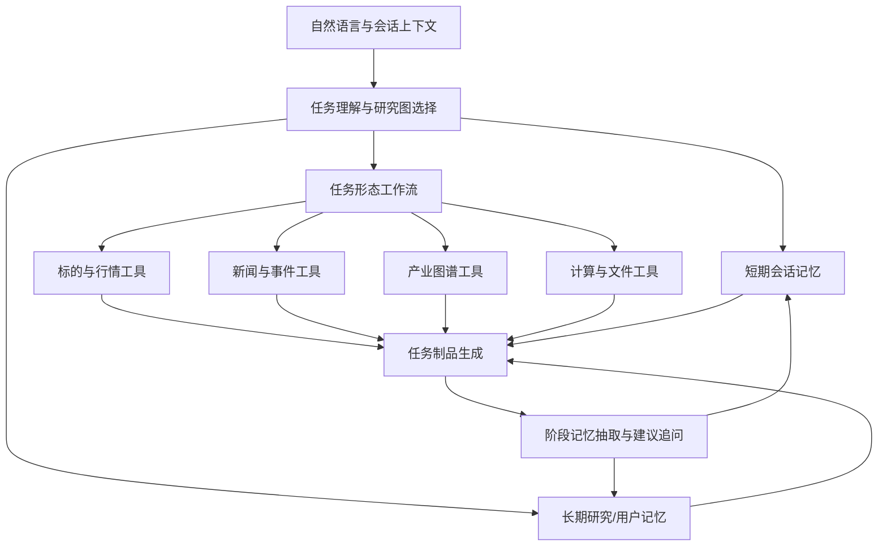
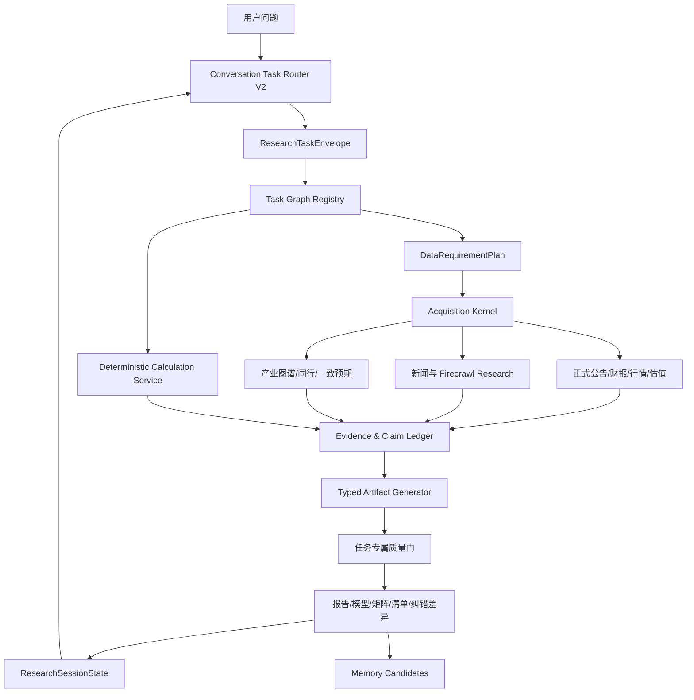

# Knevo 今日会话复盘、系统差距与下一阶段施工计划

## 1. 复盘范围与证据边界

本次通过用户本地已登录的 Chrome 查看 `https://knevo.ai/chat`，定位到今日会话“我再考虑把阳光电源的…”。会话实际包含六个用户回合，其中五个是连续研究问题，一个是对错误市值的纠正。

界面能够确认每轮问题、最终回答、工具名称、工具数量、耗时、建议追问和记忆候选；界面没有展开工具参数和原始返回。因此，下文对数据字段与使用方式的判断，分为两类：

- **直接观察**：工具名称、回答中出现的数据、表格、结论和工作流叙述；
- **高置信度推演**：依据工具名称与回答内容之间的对应关系推断的数据流，不假装看到了不可见的后端请求。

## 2. 六轮交互拆解

### 2.1 阳光电源换海光信息：双标的换仓决策

用户问题：考虑把阳光电源持仓换成海光信息，希望分析并给建议。

可见工具：`Load Workflow`、`Finance Instrument ×2`、`Finance Memory Query ×2`、`Finance Graph Context ×2`、`Finance News ×2`、`Suggest Options`。

回答使用的数据：

- 两个标的的价格、市值、PE、PB、ROE、毛利率、负债率、收入和利润；
- 两家公司近期回撤和行业属性；
- 公司和产业图谱；
- 历史研究记忆与用户既有框架；
- 公司新闻、催化和风险。

分析方法：

1. 先把“要不要换”拆成两个标的各自的生命周期、基本面、估值、催化和风险；
2. 再做同口径横向比较，而不是分别写两篇公司报告；
3. 最后把观点转化为仓位、节奏和触发信号，而非只给“看多/看空”。

为什么使用这条流程：这是一个相对决策，不需要十五章公司百科，但需要两个标的同步取数、历史观点复用和产业位置比较。Knevo 因此并行拉取两个标的，而不是启动单标的深研。

值得学习：任务目标直接决定数据矩阵和输出形式。

需要警惕：答案中的部分前瞻判断和仓位建议没有展示逐项证据来源，结论可读性强，但可审计性有限。

### 2.2 海光信息 2026—2028 估值：经营驱动模型

用户问题：按 DCU 出货量、CPU 份额和利润率假设，测算合理市值区间与当前价格隐含增速。

可见工具：`Run Sandbox`、`Write File`、再次 `Run Sandbox`、`Suggest Options`。回答明确说明沙箱不可用，随后改为手工计算。

回答使用的数据与假设：

- 2026—2028 年 DCU 出货量、ASP 和收入；
- CPU 收入/份额假设；
- 分部毛利率、费用率、税率；
- 净利润、EPS、终值 PE；
- 当前价格、市值和隐含增长；
- 悲观、基准、乐观、超乐观四情景及敏感性。

分析方法：从经营驱动量推导收入，再推导利润和 EPS，最后用估值倍数得到目标市值；同时反解当前价格隐含的增长假设，用于判断市场已经计价了什么。

为什么使用这条流程：用户问的是“价格隐含什么”，不能只引用 PE 或券商目标价，必须进行可计算、可反推的模型。

值得学习：运营变量 → 财务结果 → 估值 → 隐含预期的完整链条。

需要警惕：计算沙箱失败后手算是严重的可靠性降级；输入假设的来源和版本也没有逐项可见。我们的实现必须在这一点上显著优于 Knevo。

### 2.3 超节点预期差标的：主题候选筛选

用户问题：既然海光估值昂贵、超节点是第一优先级，要求寻找预期差强、可能低估、弹性大的标的。

可见工具：`Load Workflow`、`Recall Short Term`、`Finance Memory Query ×4`、`Finance Quote`、`Finance Memory Stage Extraction`、`Suggest Options`。

回答使用的数据：

- 上两轮关于海光、估值和超节点方向的短期上下文；
- 产业链记忆、公司关系和历史研究框架；
- 候选公司的即时报价/市值；
- 候选标的的业务暴露、估值弹性、市场关注度和波动。

分析方法：不是从全市场按涨跌幅选股，而是先确定主题链条，再按“逻辑纯度、预期差、估值弹性、拥挤度/波动”排序，输出星网锐捷、锐捷网络、紫光股份、华丰科技等候选。

为什么使用这条流程：这是“基于上一轮主题结论继续找标的”，短期记忆比重新跑一次全市场深研更重要；报价工具负责把候选观点锚定到当前定价。

值得学习：短期上下文和长期研究记忆分开调用，并在任务结束后抽取可复用框架。

暴露的问题：星网锐捷市值被写成约 199 亿元，随后被用户指出实际约 260 亿元；错误市值又导致控股折价从约 18% 被错误放大到约 60%。这说明候选排序中的关键数值没有通过一致性校验，派生结论也没有依赖追踪。

### 2.4 用户纠错市值：事实修正

用户问题：指出星网锐捷市值为 260 亿元，不是 199 亿元。

可见工具：只有 `Suggest Options`，没有再次显示 `Finance Quote` 或 `Finance Instrument`。

回答行为：承认股份数使用错误，修正星网锐捷市值、锐捷网络持股价值和控股折价，从约 60% 改为约 18%。

为什么这样处理：系统把用户提供的新数值作为更高优先级输入，快速重算派生结论。

值得学习：承认错误并明确说明哪些结论随之变化。

需要改进：没有可见的重新取数动作，也没有列出受影响主张的完整差异。高质量系统不应只“口头改正”，而应重新获取权威数据、冻结依赖结论、确定性重算并生成 correction diff。

### 2.5 DCI 为什么长期缺催化：产业因果解释

用户问题：A 股很久没有提 DCI，需求预期明确但为什么一直没有催化。

可见工具：`Finance Memory Query ×2`、`Finance News`、`Suggest Options`。

回答使用的数据：

- 既有 DCI 产业链和投资框架记忆；
- 当前新闻与市场叙事；
- 相干 DSP、光模块、DCI 系统、放大器、泵浦激光器、光纤光缆等产业链位置；
- 全球龙头和 A 股映射关系；
- 订单到收入的时间滞后。

分析方法：把“需求是否存在”和“股票为什么不涨”分开，依次检查真实需求、A 股可投资映射、叙事竞争、订单传导时滞和估值压缩。

为什么使用这条流程：这是解释型任务，不需要完整财务模型；核心是历史框架加最新事件验证，形成因果链，而不是罗列新闻。

值得学习：需求真相、资产映射、注意力分配和财务传导四层分解。

### 2.6 德科立认证/工厂/建仓信号：单标的信号计划

用户问题：梳理德科立 800G 相干认证、泰国工厂状态，以及什么信号出现时值得建仓。

可见工具：`Finance Instrument`、`Finance News`、`Finance Memory Query`、`Finance Memory Stage Extraction`、`Suggest Options`。

回答使用的数据：

- 最新价格、市值、PE、收入、利润、毛利率、阶段回撤和融资余额变化；
- 800G 相干产品样品、认证、量产状态；
- 泰国工厂投产、利用率、爬坡和批量订单信息；
- 公司公告/新闻；
- 上一轮形成的 DCI 传导框架和用户偏好。

分析方法：先区分“工厂已开”和“产能被订单利用”，再把 CSP 资本开支 → 海外系统商订单 → 德科立采购订单 → 收入确认的 2—3 个季度链条映射到领先信号；最后输出观察仓、认证信号、双变量确认三阶段方案。

为什么使用这条流程：用户不只是问公司现状，而是问“何时行动”，因此必须把事实状态、缺失证据、领先指标、时间延迟和仓位动作连起来。

值得学习：从静态研究结论升级为可持续跟踪的触发器体系，并把框架提取为候选记忆。

## 3. Knevo 背后的产品架构推演

从可见行为看，Knevo 很可能采用以下分层。具体内部技术不可见，以下是行为级推演，不是源码事实。

关键不是工具数量，而是三个机制：

1. **按任务选择图**：比较、估值、筛选、解释和信号计划走不同路径；
2. **上下文连续性**：上一轮结论会成为下一轮的研究前提，但可被用户纠正；
3. **任务形态输出**：模型、候选表、解释链和信号清单各用适合的结构，不强制长报告。

## 4. 当前本地系统的真实能力

### 4.1 已经明显强于此前、值得保留的能力

- 个股深度研究 V3 已有 27 个真实阶段、15 章报告、章节覆盖和引用质量门；
- Acquisition Kernel 已实现 `cache_only / refresh_if_stale / force_refresh`、Provider 路由、原始材料、标准化事实、候选证据、冲突隔离和伴随沉淀；
- 巨潮与深交所正式公告、年报 PDF、三张报表核心字段已贯通；
- 深交所行情、腾讯和百度估值交叉验证、同行同口径比较已经跑通；
- 研究记忆已具备 candidate → approved/rejected/archived、证据链接、版本和审核日志；
- 前台已能区分外层意图编排与内层研究阶段，完整报告正文不会再被运行状态污染。

这些基础决定了我们不需要复制 Knevo 的全部实现；我们要把现有治理和数据可信度接到更灵活的任务图上。

### 4.2 当前关键差距

| 维度 | 当前系统 | Knevo 会话表现 | 关键差距 |
|---|---|---|---|
| 意图路由 | LLM 路由加规则校验，但意图粒度较粗 | 能区分换仓、经营估值、主题筛选、因果解释、信号计划 | 缺少任务形态和输出制品识别 |
| 追问 | “继续/刚才/上面”等会提前强制走 `chat → analyze_with_llm` | 后续问题继承上轮主题、标的和框架，并调用新工具 | 追问没有持续任务状态和再规划 |
| 工作流 | 个股深研 V3 很完整，其他任务多为固定短链或通用 LLM | 每类问题使用不同研究图 | 一个深研主链无法覆盖全部研究任务 |
| 数据计划 | V3 有固定章节覆盖与需求清单 | 每轮只取该问题需要的数据 | 缺少通用的 task-specific requirement planner |
| 多标比较 | `spawn_sub_agents → analyze_with_llm`，治理较弱 | 两标的同步取 instrument、memory、graph、news | 缺少同口径矩阵、相对决策和仓位信号制品 |
| 数值建模 | 估值章节偏历史/静态口径，没有经营驱动模型服务 | 情景、敏感性、反解隐含增长 | 缺少确定性计算引擎和模型制品 |
| 事实纠错 | 没有独立纠错图和依赖重算 | 能快速修正，但未显式重新取数 | 我们应实现更严格的 claim correction |
| 新闻/开放研究 | Firecrawl 已存在于旧新闻服务，但正文仍截到 2000 字，尚未进入 V3 Acquisition Provider | 新闻与记忆能服务多个任务图 | 需要把 Firecrawl 从旧服务迁入受治理采集内核 |
| 图谱 | V3 可从 sector config 得到静态 peers/US benchmarks | 图谱随公司和主题任务调用 | 缺少动态产业节点、上下游关系和主题暴露 |
| 记忆 | 有两套并行实现；V3 可生成候选论点，通用聊天另存向量历史 | 会话短期记忆、研究记忆、阶段提取、命中次数和待确认候选较统一 | 需要统一模型、用途边界和前台审核入口 |
| 输出 | 深研长报告强，其他回答多依赖通用文本 | 根据任务输出决策、模型、矩阵、解释或信号计划 | 缺少制品多态和各自质量门 |

### 4.3 三个必须优先解决的架构问题

1. `workflow-engine.js` 在 LLM 路由之前用正则把追问直接降级为通用聊天；这与持续研究目标冲突。
2. `WorkflowEngine` 的动态流程默认最多 12 步且重规划默认关闭；V3 的 27 阶段藏在单个外层工具里，其他任务无法复用这些内部能力。
3. 旧 Node 工作流、Python V3 受治理工作流、通用向量记忆和治理记忆并行存在，能力有重复但契约不统一。

## 5. 不应直接照抄 Knevo 的部分

- 不复制“工具失败后由模型手算核心数字”；
- 不允许未经跨源校验的市值进入控股折价、排序和仓位结论；
- 不把模型叙述当证据；
- 不为展示效果虚构子 Agent 或步骤；
- 不自动把临时观点提升为长期记忆；
- 不让工作流无限动态化，执行工具仍必须受任务允许列表和数据契约约束。

## 6. 下一阶段总体架构

## 7. 按顺序施工的批次

### 批次 A：Conversation Task Router V2 与持续研究状态

目标：让自然语言问题稳定进入正确任务图，并让连续追问继承必要上下文。

实现：

- 新增 `ResearchTaskEnvelope`：`task_type`、`entities[]`、`topic`、`time_horizon`、`decision_goal`、`requested_artifact`、`constraints`、`parent_task_id`、`relation_to_previous`、`confidence`；
- 新增 `ResearchSessionState`：当前主题、标的、已确认事实、模型假设、数据快照引用、待验证问题、用户纠错、最近制品；
- 取消“识别到追问就直接走通用聊天”的前置短路；
- LLM 先判断 `continue / derive / correct / new_task`，确定性校验器再核对实体与允许工作流；
- 保存每次路由的输入、结果、纠偏原因和上下文引用。

验收：用本次六轮问法逐轮回放，六轮分别路由到换仓、估值、主题筛选、纠错、因果解释和信号计划；任何一轮不得退回无数据通用聊天。

### 批次 B：共享金融工具门面与任务数据计划

目标：把现有 V3 内部能力变成多个任务图可复用的受治理工具。

优先工具：

- `finance_entity_resolve`；
- `finance_instrument_snapshot`；
- `finance_official_filings`；
- `finance_financials`；
- `finance_valuation_snapshot`；
- `finance_peer_comparison`；
- `finance_news_events`；
- `finance_memory_query`；
- `finance_graph_context`。

统一返回 `ToolResultEnvelope`：数据时点、来源等级、来源 URL/文档、单位、完整性、新鲜度、冲突、证据 ID 和允许用途。旧工具只做适配层，不再各自定义字段口径。

验收：同一个阳光电源/海光信息请求只采集比较需要的字段；同一市值在仪表、比较矩阵和派生计算中必须来自同一快照或显式标注时点差异。

### 批次 C：经营驱动估值工作流 V1

这是下一条应做到极致的独立工作流，也是后续换仓和主题筛选的基础。

流程：

1. 解析标的、预测期和用户指定驱动变量；
2. 读取正式历史财务、当前行情估值、可用一致预期和研究记忆；
3. 生成可编辑的假设表与来源状态；
4. 确定性计算收入、利润、EPS、目标市值/价格、IRR；
5. 反解当前价格隐含的出货量、利润率或 CAGR；
6. 生成二维敏感性表和悲观/基准/乐观情景；
7. 事实、单位、公式和结果复核；
8. 保存模型 JSON、Markdown 报告和 CSV/XLSX 表格。

硬门槛：任何核心结果必须可由保存的输入和公式复算；计算引擎失败则任务失败，不允许 LLM 手算替代。

金标准：复现“海光信息 2026—2028 DCU 出货量、CPU 份额、利润率”问题，并通过手工独立复核与边界测试。

### 批次 D：双标的换仓决策工作流 V1

流程：

1. 两标的并行解析和同一时点快照；
2. 生命周期、基本面、估值、盈利质量、催化、风险和拥挤度矩阵；
3. 调用批次 C 的估值结果；
4. 读取用户明确确认的持仓约束与风险偏好；
5. 比较继续持有、部分换仓、完全换仓和暂缓四方案；
6. 输出触发条件、失效条件、分批节奏和需要继续跟踪的数据。

边界：系统提供研究决策支持，不自动交易；仓位建议必须显示依赖的风险假设。

金标准：复现“阳光电源换海光信息”，且不得把两篇单股报告简单拼接。

### 批次 E：Firecrawl Research Provider 与开放式补证

目标：把现有 Firecrawl 从“旧新闻服务的正文补充器”升级为 Acquisition Kernel 的开放研究 Provider。

实现：

- 保存完整 Markdown/HTML、URL、页面标题、页面时间、抓取时间、内容哈希和清洗版本，不再截断到 2000 字；
- 搜索任务按章节/问题生成，不进行无目标全网抓取；
- 公司官网、交易所、政府/协会、客户/供应商和高质量媒体分级；
- LLM/Research Agent 只从已保存正文抽取 `EvidenceCandidate`，不得直接写 `normalized_fact`；
- 正文去重、转载聚类、页面时间识别、低质量隔离和引用回链；
- 正式来源优先，Firecrawl 不承担可由确定性连接器获取的行情和财务核心字段。

优先补充数据：一致预期/前瞻盈利、融资余额、机构调研、产品认证、海外客户/系统商订单、工厂投产与利用率、主题产业关系。

### 批次 F：主题预期差、产业因果与信号计划三个工作流

按以下顺序逐个完成，不并行铺开：

1. `theme_expectation_gap_v1`：产业节点 → A 股映射 → 业务纯度 → 预期差 → 估值弹性 → 拥挤度 → 候选矩阵；
2. `industry_causal_explainer_v1`：需求事实 → 可投资映射 → 叙事竞争 → 订单/收入传导 → 催化与证伪；
3. `company_signal_plan_v1`：当前状态 → 缺失证据 → 领先信号 → 时间链 → 观察/确认/失效动作。

每完成一个工作流，先用真实标的跑通、审阅结果、修复问题，再开始下一个。

### 批次 G：事实纠错与依赖重算

实现：

- 建立 `ClaimDependencyGraph`；
- 用户纠错或来源冲突时，标记 disputed claim；
- 重新调用权威数据工具；
- 重算依赖字段和排序；
- 输出 before/after、变化原因、受影响结论和仍未解决的冲突；
- 更新会话状态，保留原版本审计记录。

金标准：把“星网锐捷 199 亿 → 260 亿”的场景作为固定回归，确保控股折价、候选排名和结论同步更新。

### 批次 H：统一记忆与任务制品前台

实现：

- 合并通用向量历史与治理记忆的用途边界；
- 四类记忆分别存储：会话工作记忆、用户偏好、事实/论点、可复用研究框架；
- 增加标签、项目、命中次数、最近命中和来源任务；
- 候选记忆支持确认、编辑、拒绝、归档；
- 前台显示真实研究目标、工具分组、数据时点/来源/质量和制品，而不是只显示技术步骤计数；
- 每轮根据当前任务和未解决缺口生成 2—3 个建议追问。

## 8. 全链路验收集

以本次 Knevo 六轮会话为首个对话回放集，并增加反例：

1. 双标的换仓：同一时点、同一单位、相对结论可追溯；
2. 经营估值：公式可复算，当前价格隐含预期正确；
3. 主题筛选：关键市值跨源一致，排序理由逐项可解释；
4. 用户纠错：重新取数、依赖重算、差异完整；
5. 因果解释：区分需求、映射、叙事和兑现时滞；
6. 信号计划：事实状态、领先指标、触发条件和证伪条件齐全；
7. 模型不可用：确定性数据和计算仍可运行，综合文本明确降级；
8. Firecrawl 不可用：正式数据不受影响，开放式证据标记缺口；
9. 旧数据过期：不得继承为当前事实；
10. 追问“继续/那它呢/你刚才说的第二个”：能正确解析上轮对象和任务关系。

统一质量门：

- 核心数值事实错误数为 0；
- 单位/报告期/行情时点混用为 0；
- 计算结果 100% 可复算；
- 核心主张引用覆盖率 100%；
- 纠错后遗漏重算的依赖结论为 0；
- 任务制品结构覆盖率 100%；
- 前台最终正文不出现内部状态文案；
- 六轮连续回放全部进入正确工作流且产出可用制品。

## 9. 推荐的立即下一步

不建议现在直接扩大 Firecrawl 抓取面。最先施工应是批次 A，然后完成批次 B 的最小共享工具契约，紧接着把“经营驱动估值 V1”做成第一条新任务工作流。原因是：

- 没有持续会话状态，新增数据仍会在追问时丢失；
- 没有任务数据计划，Firecrawl 会重新制造“采了很多但流程消化不了”的问题；
- 估值工作流边界清晰、可确定性验收，又是换仓和主题筛选的共同基础；
- 完成估值后再做双标的换仓，可复用真实模型而不是依赖语言判断。

因此推荐的实际顺序是：

`Router V2 / Session State → Shared Tool Envelope → 经营驱动估值 V1 → 双标的换仓 V1 → Firecrawl Research Provider → 主题筛选 → 因果解释 → 信号计划 → 纠错图与统一记忆前台`。
