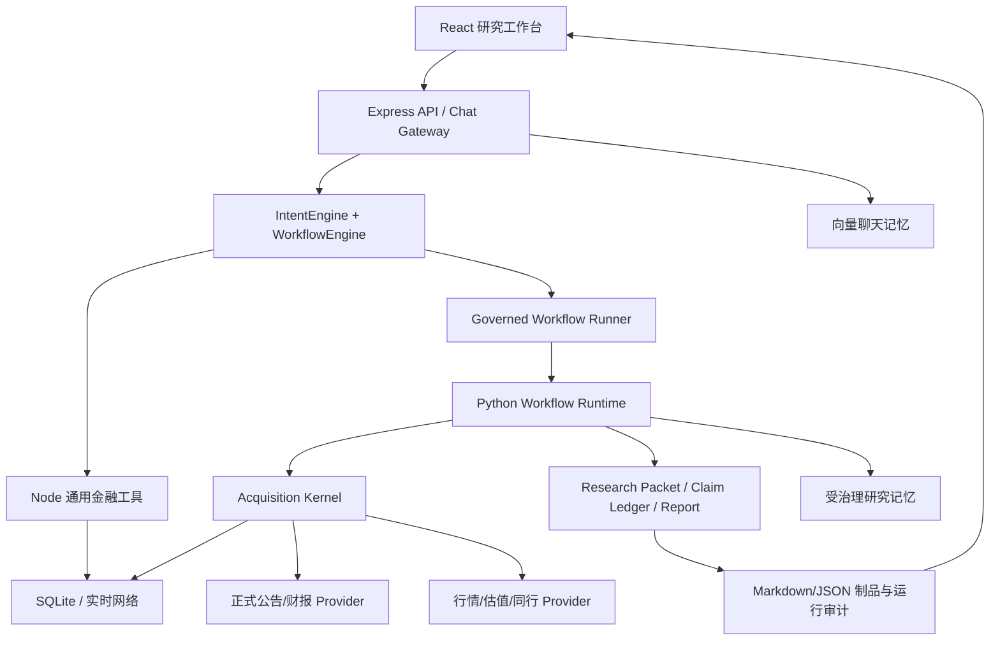
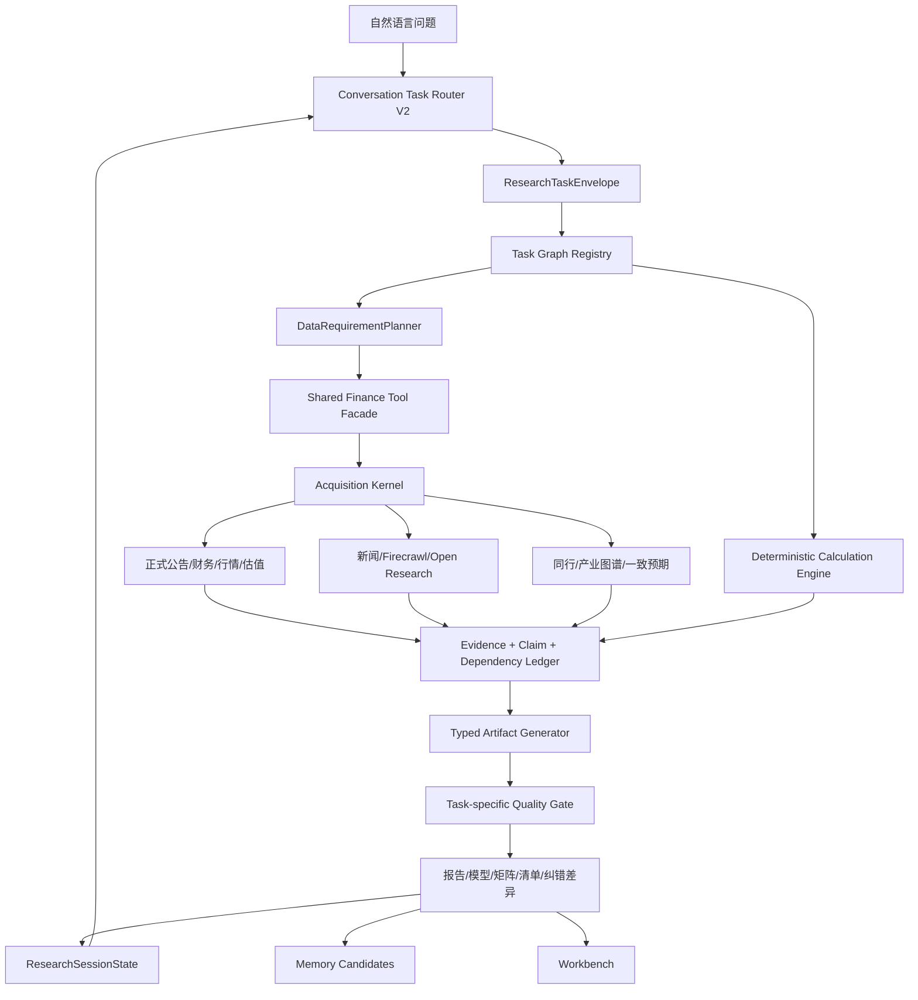

# SMR 研究 Agent 系统总体现状、Knevo 差距与开发实施计划

> **For Coding Agents:** REQUIRED EXECUTION DISCIPLINE: read this document and the linked ADR/specification files before changing code; execute one phase at a time with test-first checkpoints and do not overwrite the existing dirty worktree.

**Goal:** 在保留现有正式数据、证据治理和个股深度研究 V3 成果的前提下，把 SMR 升级为自然语言驱动、可连续追问、按问题形态选择研究图、按需补证、确定性计算并输出高质量任务制品的个人投研 Agent。

**Architecture:** 保持本地优先的模块化单体：React 工作台负责聊天、进度和制品展示；Express 负责任务理解、会话状态、工具编排和 API；Python 受治理运行时负责长流程、证据、数据采集、确定性分析和制品；SQLite 保存控制面、研究数据、证据、记忆与审计。动态性只存在于“选择哪条已注册任务图、填充哪些数据需求”，事实、计算、写入和质量门仍受确定性契约控制。

**Tech Stack:** Windows、PowerShell、Node.js 20+、TypeScript、React、Vite、Express、Python 3.11+、SQLite、MiniMax Anthropic-compatible API、Firecrawl、Vitest、Node Test Runner、unittest、pytest。

---

## 1. 产品目标与边界

### 1.1 当前 MVP 的真实目标

本项目不是全市场量化平台，也不是面向多人交付的 SaaS。它当前要解决的是：用户用自然语言提出一类研究任务，系统自动理解任务，调用已经固化的研究流程，从本地数据库和实时网络补齐所需数据，完成可验证分析，生成用户真正能阅读和使用的研究制品，并把有价值的资料与候选记忆沉淀下来。

### 1.2 必须坚持的产品边界

- 只用于研究辅助、模拟复盘和纸面组合，不连接券商，不执行真实交易；
- 用户不需要记忆工作流名称或固定提问模板；
- 核心财务、行情、估值和公司事实必须可追溯；
- LLM 可以做意图理解、研究规划、开放式发现和文字综合，不能替代确定性计算与事实校验；
- 数据不足时可以明确降级，但不能把系统状态伪装成研究报告；
- 研究结果可以产生候选记忆，未经审核不能自动成为长期正式记忆；
- 暂不引入微服务、消息队列、云数据仓库、Kubernetes 或全市场高频调度；
- 不恢复已经停用的全量定时采集。数据策略仍是“按需采集 + 伴随沉淀”。

## 2. 当前仓库与运行状态

### 2.1 工作区

- 仓库：`D:\李少博的文件\TH_Capital_二级市场\th_capital_stock_mvp`
- 当前分支：`refactor/personal-research-mvp`
- 前台：`http://127.0.0.1:5173/workbench`
- API：`http://127.0.0.1:3000`
- Firecrawl：本地 Docker 服务，当前代码默认请求 `http://localhost:3002/v1/scrape`
- 控制数据库：`01_data/db/smr.db`
- 外部真实研究库：默认 `../th_capital_stock/01_data/db/smr.db`，可通过启动参数覆盖
- 当前工作区有大量已修改和未跟踪文件，包含最近几轮有效开发成果。它们不是可随意删除的临时文件。

### 2.2 启动与验证命令

安装：

```powershell
py -3 -m venv .venv
.\.venv\Scripts\python.exe -m pip install -r requirements-dev.txt
npm ci
```

诊断与启动：

```powershell
powershell -NoProfile -ExecutionPolicy Bypass -File .\scripts\doctor.ps1
powershell -NoProfile -ExecutionPolicy Bypass -File .\scripts\start-local.ps1
```

停止：

```powershell
powershell -NoProfile -ExecutionPolicy Bypass -File .\scripts\stop-local.ps1
```

快速检查：

```powershell
npm.cmd run check:quick
```

完整检查：

```powershell
npm.cmd run check:full
```

Windows PowerShell 可能禁止执行 `npm.ps1`，因此交接和自动化命令统一使用 `npm.cmd`。

### 2.3 2026-07-22 实测基线

| 测试组 | 结果 |
|---|---:|
| TypeScript + Express 语法 + smoke | 通过，smoke 19 项 |
| Python runtime | 33/33 通过 |
| Python workflows | 45/45 通过 |
| Python self-discovery | 132/132 通过 |
| Express API | 74 通过，0 失败，1 个有意跳过 |
| React UI | 9/9 通过 |
| `check:full` 总入口 | 在 repository inventory audit 停止 |

`check:full` 的阻断原因是 `legacy_manifest` 尚未纳入最近新增和修改文件。该阻断不代表业务测试失败，但在阶段 0 必须用仓库自带的只读/保守资产清单流程重新同步并复核，不能绕过或删除清单门禁。

## 3. 当前系统架构



### 3.1 前台层

主要入口：

- `src/app/ResearchWorkbench.tsx`
- `src/features/chat/ChatPanel.tsx`
- `src/features/chat/SessionSidebar.tsx`
- `src/features/workflows/RunTimeline.tsx`
- `src/features/workflows/ArtifactViewer.tsx`
- `src/app/workbench.css`

已具备：

- 浅色中文研究工作台；
- 会话创建、恢复、置顶、归档和删除；
- Markdown 报告展示；
- 外层意图编排与内层研究阶段分层展示；
- 研究制品链接和执行信息独立显示，不再污染报告正文；
- 真实工作流事件驱动的阶段进度。

当前不足：

- 主要围绕“长报告 + 阶段进度”设计，尚不支持估值模型、比较矩阵、纠错差异和信号清单等多态制品；
- 工具调用仅能展示步骤，不能清晰展示每次数据的来源、时点、质量和用途；
- 候选记忆的确认、编辑、拒绝和命中信息尚未形成统一产品入口；
- 会话消息发送时对历史内容存在截断，不能把它当作可靠的研究任务状态。

### 3.2 Express 对话与编排层

主要文件：

- `api/services/intent-engine.js`
- `api/services/workflow-engine.js`
- `api/services/agent-orchestrator.js`
- `api/services/chat-enhanced-service.js`
- `api/services/governed-workflow-runner.js`
- `api/services/workflow-audit-service.js`
- `api/services/research-execution-summary.js`

已具备：

- LLM 自然语言意图解析；
- 确定性规则校验和模型不可用降级；
- 多类 Node 任务类型和金融工具；
- 对明确个股深研请求强制进入受治理 V3；
- 工作流执行历史、证据捕获、质量门和审计；
- 写记忆和写决策的授权保护；
- API 返回研究主任务、子运行和制品信息。

关键缺陷：

1. `workflow-engine.js` 在调用 LLM 路由前，通过 `isFollowUpQuestion()` 把“继续、刚才、上面”等追问固定降级为 `chat → analyze_with_llm`；
2. 当前 `contextSummary` 只保留少量标的字段，不能表达持续研究任务、上轮模型假设、制品引用和待验证问题；
3. `TASK_TYPES` 粒度偏粗，缺少经营估值、换仓决策、主题筛选、产业解释、信号计划和事实纠错；
4. 通用动态工具链默认最多 12 步、默认不重规划，不能承担复杂研究图；
5. Node 的旧研究工具与 Python V3 受治理能力并存，字段和证据契约没有统一；
6. 多标的比较仍主要依赖 `spawn_sub_agents + analyze_with_llm`，没有同口径矩阵和派生计算门禁。

### 3.3 Python 受治理工作流层

生产注册表：`smr_app/runtime/registry.py`

当前四条固定工作流：

- `stock_deep_dive`
- `daily_brief`
- `portfolio_review`
- `thesis_update`

核心运行时：

- `smr_app/runtime/runner.py`
- `smr_app/runtime/event_store.py`
- `smr_app/runtime/artifact_store.py`

优势：

- 阶段状态、事件和制品均可追溯；
- 顺序执行便于隔离失败；
- 支持取消、等待审核、恢复、并发写保护；
- 正式工作流不依赖历史 phase 脚本；
- 高判断写入必须等待人工审核。

当前不足：四条工作流不足以覆盖 Knevo 会话中展示的多种任务形态；共享数据和分析能力还没有形成可组合的任务图组件库。

### 3.4 个股深度研究 V3

入口：`smr_app/workflows/stock_deep_dive.py`

当前真实 27 阶段：

1. 校验标的；
2. 生成研究计划；
3. 生成数据需求清单；
4. 检查 Provider；
5. 加载结构化数据；
6. 检索正式公告和研究语料；
7. 检索记忆；
8. 检索新闻与事件；
9. 加载行业图谱；
10. 加载目标与同行；
11. 组装研究上下文；
12. 评估缓存；
13. 采集缺失数据；
14. 校验采集结果；
15. 回流已核验数据；
16. 标准化与隔离；
17. 构建 Research Packet；
18. 分析行情、估值和同行；
19. 分析财务与现金流；
20. 分析业务、行业和竞争力；
21. 分析催化、风险和证伪；
22. 汇总章节分析；
23. 编译确定性主张；
24. 质量门；
25. 生成长报告；
26. 校验结构、事实和引用；
27. 保存报告、证据包、审计和候选记忆。

报告结构已经覆盖 15 章，并经过真实 `300308.SZ` 端到端验证。它是当前最成熟的工作流，后续不得回退到旧 V1/V2 或通用 LLM 报告。

当前不足：

- 它是“全面公司长报告”，不能替代估值模型、换仓备忘录或主题筛选；
- 章节计划是固定的，尚不能根据任务只执行必要分支；
- 行业、竞争、催化和风险的开放式外部补证仍偏弱；
- 估值章节主要是时点估值和边界说明，不是经营驱动模型；
- 同行池仍以配置为主，缺少动态产业关系和前瞻指标。

### 3.5 Acquisition Kernel 与数据可信层

主要目录：

- `smr_app/acquisition/contracts.py`
- `smr_app/acquisition/kernel.py`
- `smr_app/acquisition/store.py`
- `smr_app/acquisition/providers/cninfo.py`
- `smr_app/acquisition/providers/szse.py`
- `smr_app/acquisition/providers/market.py`
- `smr_app/research/acquisition_materializer_v3.py`
- `migrations/0007_acquisition_kernel.sql`

已具备：

- `DataRequirement`；
- `cache_only / refresh_if_stale / force_refresh`；
- Provider 路由和主/备用源；
- acquisition request/run 审计；
- 原始文档、标准化事实、候选证据、数据集状态；
- `last_checked_at` 与 `available_through` 分离；
- 冲突隔离而非覆盖；
- 获取后 write-through 沉淀；
- 获取结果回流研究上下文，避免“采到了但报告不用”。

这是后续所有任务工作流的数据底座，不能另起一套网络抓取存储。

### 3.6 当前正式数据能力

#### 公告与财务

- 巨潮资讯主源；
- 深交所正式披露降级源；
- 年报 PDF 原文保存、哈希、文本和表格解析；
- 收入、归母净利润、扣非净利润、经营现金流、EPS、ROE、资产、净资产等三年数据；
- 报告期、单位、币种和字段来源校验。

#### 行情

- 深交所正式日线和实时/收盘后数据；
- 腾讯实时行情；
- 新浪指数与榜单；
- 交易日、节假日、盘中观察和已完成交易日区分；
- 分钟明细对异常成交量进行校正。

#### 估值

- 腾讯总市值、PE(TTM)、PB 等当前快照；
- 百度历史估值序列；
- 深交所价格作为价格锚；
- 时点折算和跨源阈值校验；
- 不一致单元格局部隔离。

#### 同行

- `config/peer_sets.json` 显式同行集合；
- 同币种、同交易日价格、市值、PE 和 PB 比较；
- 同行选择方法和证据写入报告。

#### 新闻与 Firecrawl

- `api/services/chinese-news-service.js` 已能从若干新闻源抓取列表；
- Firecrawl 已能补充正文并做来源级清洗和最低长度校验；
- 当前正文写回仍截断至 2000 字；
- Firecrawl 仍位于旧 Node 新闻服务，未成为 Acquisition Provider；
- 页面原文、内容哈希、抓取版本和 EvidenceCandidate 晋升链尚未统一。

### 3.7 证据、主张和报告质量

主要文件：

- `smr_app/research/research_packet_v2.py`
- `smr_app/research/normalization.py`
- `smr_app/research/claim_compiler.py`
- `smr_app/research/quality_gate.py`
- `smr_app/research/report_v3.py`
- `api/services/citation-validator.js`
- `api/services/stock-research-v3-service.js`

已有保护：

- 未知引用拒绝；
- 隔离字段不得进入结论；
- 来源用途限制；
- 报告期、单位和币种冲突隔离；
- 缺失字段转化为调查问题，而不是编造主张；
- 模型改写不能增加未批准主张；
- 质量门拒绝禁止性结论、系统元数据和短/空报告；
- 模型不可用仍保留受治理的确定性草稿。

### 3.8 记忆系统

当前存在两条并行路径：

1. `api/services/vector-memory.js` 保存聊天内容和向量相似搜索；
2. `smr_app/adapters/memory.py` 与 `api/services/memory-service.js` 管理结构化研究记忆。

治理记忆已具备：

- candidate、approved、rejected、archived；
- evidence links；
- parent/version/field diff；
- reviewer/reason/time；
- 新版本批准时归档旧版本。

当前问题：

- 两套实现职责重叠；
- V3 查询时会同时读取 approved 和 candidate，需进一步限定 candidate 的使用方式；
- 缺少会话工作记忆、用户偏好、事实/论点、分析框架的严格类型隔离；
- 缺少统一的命中次数、标签、项目和前台审核体验；
- “聊天历史向量”不能替代明确的任务状态。

### 3.9 历史代码和仓库冗余

仓库中仍有大量 `phaseXX` 配置、脚本、报告生成器和旧控制台资产。当前新运行时已有测试保证不直接 import 历史 phase 模块，但仓库还承担历史审计和真实数据资产的保存职责。

清理原则：

- 先由 `tools/inventory_repository.py` 分类；
- `DELETE_CANDIDATE` 不等于允许删除；
- 任何删除必须确认未被 README、runbook、测试、数据库元数据或当前运行时引用；
- 历史配置优先 freeze/archive，而非物理删除；
- 不得用批量 glob 或跨 shell 拼接路径做删除；
- 当前开发主线只在 `src/`、`api/`、`smr_app/`、`migrations/`、`config/`、`tests/`、`docs/` 和 `scripts/` 中继续演进。

## 4. Knevo 今日会话揭示的产品能力

今日会话实际包含六种连续任务：

1. 阳光电源换海光信息：双标的换仓；
2. 海光信息 2026—2028：经营驱动估值；
3. 超节点方向：主题预期差筛选；
4. 星网锐捷市值错误：用户纠错；
5. DCI 缺催化：产业因果解释；
6. 德科立：认证、工厂和建仓信号计划。

可见工具包括：Instrument、Quote、News、Graph Context、Memory Query、Short-term Recall、Memory Stage Extraction、Sandbox、Write File 和 Suggest Options。

### 4.1 Knevo 值得学习的长处

- **问题形态驱动流程**：比较、估值、筛选、解释和信号计划不是同一套流程；
- **连续会话**：上一轮的标的、产业主题和判断会进入下一轮；
- **短期与长期记忆分层**：短期上下文服务当前会话，历史研究框架服务跨会话复用；
- **数据使用有目的**：比较任务取两个标的的同口径数据，解释任务侧重产业链和新闻，不每次都生成百科报告；
- **输出多态**：决策备忘录、估值模型、候选矩阵、因果解释和信号清单各自采用合适结构；
- **建议追问**：每轮输出后给出与当前缺口相关的下一步；
- **行动条件化**：把观点转化为触发、失效、观察和分阶段行动条件。

### 4.2 Knevo 暴露的弱点

- 星网锐捷市值从约 199 亿元被用户纠正为约 260 亿元；
- 错误市值导致控股折价从约 18% 被错误放大到约 60%；
- 用户纠错时没有可见的重新取数工具调用；
- 估值沙箱失败后改为手工计算；
- 最终文本中的数据没有逐项展示证据 ID 和来源时点；
- 工作流界面只能看工具名，无法审计参数和原始结果。

结论：应学习 Knevo 的任务编排、上下文连续性和输出产品化，但不能复制其数值可靠性和证据透明度缺陷。

## 5. 系统差距矩阵

| 能力 | 当前成熟度 | 与 Knevo 的差距 | 目标状态 | 优先级 |
|---|---|---|---|---|
| 个股长篇深研 | 高 | 当前证据更严，但开放式行业材料不足 | 保持 V3，补开放式补证 | P0 保持 |
| 自然语言路由 | 中 | 意图粒度粗、追问提前降级 | TaskEnvelope + 持续任务状态 | P0 |
| 多轮研究连续性 | 低 | 只有截断聊天历史，没有任务状态 | continue/derive/correct/new_task | P0 |
| 任务图注册与组合 | 低 | 多数任务仍是固定短链或通用 LLM | 每类高价值任务有独立受治理图 | P0 |
| 任务数据计划 | 中 | V3 有固定清单，其他任务没有 | 每个任务先生成 DataRequirementPlan | P0 |
| 经营驱动估值 | 低 | 缺运营变量模型、隐含预期和敏感性 | 确定性估值工作流与模型制品 | P0 |
| 双标的换仓 | 低 | 缺同口径相对决策框架 | 比较矩阵 + 情景 + 触发条件 | P1 |
| Firecrawl 研究链 | 低到中 | 旧服务、正文截断、未入证据内核 | 完整原文 + Provider + 候选证据 | P1 |
| 产业图谱 | 低到中 | 静态 peers/benchmark 为主 | 动态节点、边、暴露度和证据 | P1 |
| 主题预期差筛选 | 低 | 当前机会扫描不等于产业主题筛选 | 纯度/预期差/弹性/拥挤度矩阵 | P1 |
| 产业因果解释 | 低 | 通用聊天，缺专属证据与因果模板 | 需求→映射→叙事→兑现链 | P1 |
| 公司信号计划 | 低 | 催化章节存在，但不可执行跟踪 | 状态/领先信号/时间链/证伪 | P1 |
| 事实纠错 | 低 | 缺争议主张和依赖重算 | ClaimDependencyGraph + diff | P0/P1 |
| 统一记忆 | 中 | 两套实现、类型和产品入口不统一 | 四层记忆 + 审核 + 命中追踪 | P2 |
| 多态制品前台 | 中低 | 主要适配 Markdown 长报告 | 模型、矩阵、diff、清单组件 | P2 |
| 评测体系 | 中 | V3 金标准较强，跨任务回放不足 | 六轮会话 + 反例 + 数据源故障 | P0 持续 |
| 仓库收敛 | 中低 | 历史资产多，清单尚未同步 | 主线清晰、历史冻结、清单通过 | P0/P2 |

## 6. 目标架构



## 7. 全局开发规则

每个阶段都必须遵守：

1. 先读相关 ADR、spec 和当前实现，再写测试；
2. 先创建失败测试，确认它因目标能力缺失而失败；
3. 实现满足测试的最小改动；
4. 运行聚焦测试；
5. 运行相关回归；
6. 运行快速检查；
7. 涉及数据库、工作流、Provider 或共享契约时运行完整回归；
8. 用真实网络测试时保存来源、时点和运行 ID，不把外部网络波动写成断言；
9. 每阶段更新 spec、ADR、运行手册和验收记录；
10. 不在同一批次顺便重构无关模块；
11. 不使用 `git reset --hard`、`git checkout --` 或批量删除覆盖现有改动；
12. 未经用户要求，不提交、不推送、不改远端；
13. 不读取或输出 `.env` 中的凭证值；
14. 新数据源必须记录权威等级、覆盖范围、日期语义、限流、降级和原文保存方式。

## 8. 分阶段开发计划与验收

### 阶段 0：基线冻结、资产清单与开发边界

**目标：** 让任何 Agent 在不破坏现有成果的情况下获得可重复基线，并修复 `check:full` 的资产清单阻断。

**主要文件：**

- `legacy_manifest/inventory.json`
- `legacy_manifest/classifications.csv`
- `tools/inventory_repository.py`
- `scripts/check.ps1`
- `README.md`
- `09_runbooks/smr-local-operations.md`

**任务：**

1. 记录当前分支、状态和最近提交，不清理 dirty worktree；
2. 运行 `npm.cmd run check:quick` 保存基线；
3. 分别运行 runtime、workflow、self-discovery、API、UI 测试；
4. 用 `tools/inventory_repository.py` 重新生成保守清单；
5. 审查所有新增 `DELETE_CANDIDATE`，确保 `approved=false`；
6. 运行 `--verify-manifest`；
7. 再运行 `npm.cmd run check:full`；
8. 在 runbook 记录当前主线目录和冻结历史资产。

**测试：**

```powershell
npm.cmd run check:quick
.\.venv\Scripts\python.exe tools\inventory_repository.py --verify-manifest
npm.cmd run check:full
```

**验收：**

- `check:full` 全部通过；
- 不删除任何用户文件；
- 没有新增 `approved=true` 的删除项；
- 资产清单能覆盖本计划和新增 ADR；
- 当前 V3 金标准报告仍可读取。

### 阶段 1：ResearchTaskEnvelope 与 ResearchSessionState

**目标：** 让每条自然语言请求被解释为结构化研究任务，并让多轮会话保存研究状态，而不依赖截断聊天文本。

**拟新增：**

- `api/services/research-task-contracts.js`
- `api/services/research-session-state.js`
- `tests/api/research-task-contracts.test.js`
- `tests/api/research-session-state.test.js`

**修改：**

- `api/services/intent-engine.js`
- `api/services/workflow-engine.js`
- `api/services/chat-enhanced-service.js`
- `api/services/session-service.js`
- `migrations/0008_research_session_state.sql`
- `tests/api/chat-services.test.js`
- `tests/api/workflow-guardrails.test.js`

**契约：**

```json
{
  "task_type": "valuation_model",
  "entities": [{"ticker": "688041.SH", "role": "target"}],
  "topic": "DCU and CPU growth",
  "decision_goal": "estimate fair market cap and implied growth",
  "time_horizon": {"from": 2026, "to": 2028},
  "requested_artifact": "valuation_model",
  "relation_to_previous": "derive",
  "parent_task_id": "task_xxx",
  "constraints": {},
  "confidence": 0.95,
  "needs_clarification": false
}
```

**TDD 顺序：**

1. 写契约校验测试：未知 task type、空实体、非法 relation 必须拒绝；
2. 写会话状态序列化/恢复测试；
3. 写“继续/那第二个呢/你刚才说的海光”追问测试，确认旧逻辑失败；
4. 去掉 `isFollowUpQuestion()` 的通用聊天前置短路；
5. 实现 `continue / derive / correct / new_task`；
6. 会话消息与任务状态分开持久化；
7. 模型不可用时，只对高置信度显式请求做确定性回退；
8. 记录 routing source 和 correction reason。

**测试：**

```powershell
node --test tests/api/research-task-contracts.test.js
node --test tests/api/research-session-state.test.js
node --test tests/api/chat-services.test.js tests/api/workflow-guardrails.test.js
npm.cmd run check:quick
```

**验收：**

- 六轮 Knevo 问法分别识别为六种任务关系；
- “继续”不会自动走通用聊天；
- 新会话不污染旧会话；
- 刷新页面后任务状态可恢复；
- 临时假设不会写入正式记忆；
- 模型不可用时明确失败或走确定性高置信度路由，不假装理解复杂追问。

### 阶段 2：Conversation Task Router V2 与任务图注册表

**目标：** 将任务理解与具体工具执行解耦，让 LLM 选择已注册任务图而不是任意拼接工具。

**拟新增：**

- `api/services/task-graph-registry.js`
- `api/services/conversation-task-router-v2.js`
- `config/research_task_types.json`
- `tests/api/conversation-task-router-v2.test.js`
- `tests/api/task-graph-registry.test.js`

**修改：**

- `api/services/intent-engine.js`
- `api/services/workflow-engine.js`
- `api/services/chat-enhanced-service.js`
- `api/services/research-execution-summary.js`

**首批任务类型：**

- `stock_deep_dive`
- `operating_driver_valuation`
- `pair_switch_decision`
- `theme_expectation_gap`
- `industry_causal_explainer`
- `company_signal_plan`
- `claim_correction`
- `daily_brief`
- `portfolio_review`
- `thesis_update`

**测试：** 路由黄金样本、实体歧义、模型返回非法工具、模型不可用、任务未注册、追问派生和用户纠错。

**验收：**

- 用户不需要使用任务名称；
- 每个任务只能进入注册图和允许工具集合；
- LLM 不能绕过写入授权；
- 明确深研仍进入现有 V3；
- 路由结果和理由可审计；
- 不再依赖 `WORKFLOW_MAX_STEPS=12` 承载复杂研究本体。

### 阶段 3：共享金融工具门面与 DataRequirementPlanner

**目标：** 让多个任务图复用现有可信数据能力，避免 Node 旧工具和 Python V3 各自定义口径。

**拟新增：**

- `smr_app/research/task_requirements.py`
- `smr_app/research/tool_result.py`
- `smr_app/tools/finance_entity.py`
- `smr_app/tools/finance_instrument.py`
- `smr_app/tools/finance_filings.py`
- `smr_app/tools/finance_financials.py`
- `smr_app/tools/finance_valuation.py`
- `smr_app/tools/finance_peers.py`
- `smr_app/tools/finance_news.py`
- `smr_app/tools/finance_memory.py`
- `smr_app/tools/finance_graph.py`
- `tests/research/test_task_requirements.py`
- `tests/tools/`

**统一返回字段：**

- `entity_key`
- `data_type`
- `as_of`
- `available_through`
- `fetched_at`
- `source_ids`
- `authority_tier`
- `evidence_ids`
- `unit/currency/period`
- `freshness_status`
- `conflicts`
- `allowed_usage`
- `payload`

**实施原则：** 工具门面只包装现有 Acquisition Kernel、adapter 和数据库，不重新实现第二套采集系统。

**测试：**

- 字段契约和 JSON round-trip；
- 同一市值跨工具保持同一快照；
- 交易日、报告期、单位和币种边界；
- stale/cache miss/provider failure；
- 权威等级不足拒绝；
- 只获取任务所需数据，不强制跑完整 V3。

**验收：**

- 阳光电源/海光比较可得到同一时点矩阵；
- 估值任务不会无意义获取全部十五章数据；
- 每个结果可回溯到 acquisition request 和 evidence；
- 旧工具保留适配层，现有 API 与 V3 回归不破坏。

### 阶段 4：经营驱动估值 V1

**目标：** 完成第一条新高质量任务工作流，从运营假设确定性推导财务、目标市值和当前价格隐含预期。

**拟新增：**

- `smr_app/workflows/operating_driver_valuation.py`
- `smr_app/valuation/contracts.py`
- `smr_app/valuation/engine.py`
- `smr_app/valuation/scenarios.py`
- `smr_app/valuation/reverse_implied.py`
- `smr_app/valuation/artifacts.py`
- `config/valuation_model_templates.json`
- `tests/valuation/`
- `tests/workflows/test_operating_driver_valuation.py`
- `tools/evaluate_operating_driver_valuation.py`

**流程：**

1. 解析标的、预测期和驱动变量；
2. 读取正式历史财务、当前价格、市值和已有一致预期；
3. 生成带来源状态的假设表；
4. 验证单位、边界和变量依赖；
5. 计算收入、毛利、费用、净利润、EPS；
6. 计算目标市值、价格和 IRR；
7. 反解当前价格隐含的出货量、利润率或 CAGR；
8. 生成悲观、基准、乐观和可选扩展情景；
9. 生成二维敏感性；
10. 独立复算和质量门；
11. 保存模型 JSON、Markdown 和 CSV/XLSX。

**禁止：** 计算引擎失败后由 LLM 手工补数字。

**单元测试：**

- 收入桥、利润桥、EPS、PE 目标价；
- 反解增长；
- 单位换算；
- 零/负利润；
- 极端假设；
- 缺失股本；
- 敏感性矩阵单调性；
- JSON 模型完全可复算。

**真实金标准：** 海光信息 2026—2028，驱动变量包括 DCU 出货量、ASP、CPU 收入/份额、分部利润率、费用率和终值 PE。

**验收：**

- 所有核心数字 100% 可由保存输入和公式复算；
- 手工独立计算误差在明确容差内；
- 当前价格隐含预期与正向模型一致；
- 假设与事实明确分栏；
- 每个历史输入有来源和时点；
- 模型不可用时仍可完成确定性计算；
- 输入不足时不生成伪精确目标价。

### 阶段 5：双标的换仓决策 V1

**目标：** 输出真正的相对决策备忘录，而不是把两份个股报告拼在一起。

**拟新增：**

- `smr_app/workflows/pair_switch_decision.py`
- `smr_app/research/comparison_matrix.py`
- `smr_app/research/decision_scenarios.py`
- `tests/workflows/test_pair_switch_decision.py`
- `tools/evaluate_pair_switch_decision.py`

**分析维度：** 生命周期、收入/利润质量、现金流、ROE、估值、隐含增长、产业位置、催化、风险、拥挤度、近期价格状态和用户持仓约束。

**输出：**

- 同口径比较矩阵；
- 继续持有、部分换仓、完全换仓、暂缓四方案；
- 每个方案的成立/失效条件；
- 分批节奏和需要监控的领先指标；
- 未解决数据缺口；
- 明确不执行真实交易。

**真实金标准：** “把阳光电源持仓换成海光信息”。

**验收：**

- 两标的行情时点差不超过配置阈值；
- 市值、PE、PB、利润等单位一致；
- 调用阶段 4 的估值制品，而非重复手算；
- 用户偏好只使用明确确认信息；
- 不把昂贵/便宜直接等同于买入/卖出；
- 任一核心数据冲突时相关结论局部降级。

### 阶段 6：Firecrawl Research Provider

**目标：** 将 Firecrawl 从旧新闻正文补充器迁入受治理 Acquisition Kernel，为业务、行业、竞争、认证、工厂、订单、催化和风险提供完整开放式补证。

**拟新增：**

- `smr_app/acquisition/providers/firecrawl.py`
- `smr_app/research/open_research_plan.py`
- `smr_app/research/web_document_extractor.py`
- `config/web_source_registry.json`
- `tests/acquisition/test_firecrawl_provider.py`
- `tests/research/test_web_document_extractor.py`
- `tools/smoke_firecrawl_acquisition.py`

**修改：**

- `smr_app/acquisition/providers/__init__.py`
- `smr_app/workflows/stock_deep_dive.py`
- `api/services/chinese-news-service.js`，逐步降级为兼容层
- `docs/adr/0006-on-demand-write-through-acquisition.md`

**必须保存：** 完整 Markdown/HTML、URL、标题、作者、页面发布时间、抓取时间、内容哈希、清洗版本、来源等级、搜索任务和引用片段位置。

**测试：**

- Firecrawl 健康/超时/返回空内容；
- 完整正文不截断；
- 主体抽取和导航/广告清洗；
- 内容哈希幂等；
- 转载去重和聚类；
- 页面时间缺失；
- 低质量来源隔离；
- Agent 输出未知引用拒绝；
- Firecrawl 不可用时正式数据流程不受影响。

**真实烟测：** 公司官网、交易所/IR 页面、协会/产业材料和高质量媒体各至少一个样本。

**验收：**

- 原文完整保存，不再 `substring(0, 2000)`；
- LLM 只能从已保存原文生成 EvidenceCandidate；
- EvidenceCandidate 不直接覆盖 normalized fact；
- 正式公告/财务仍走确定性 Provider；
- 重复运行命中内容哈希，不重复沉淀；
- 网络失败产生明确执行记录和局部降级。

### 阶段 7：产业图谱与前瞻数据增强

**目标：** 支持主题筛选和因果研究所需的动态产业关系，而不是只依赖静态同行列表。

**拟新增：**

- `smr_app/research/industry_graph.py`
- `smr_app/research/graph_evidence.py`
- `migrations/0009_research_graph.sql`
- `config/industry_graph_schema.json`
- `tests/research/test_industry_graph.py`

**节点：** 公司、产品、技术、客户、供应商、系统商、终端需求、工厂、认证、订单、行业主题。

**边：** 生产、供应、采购、持股、竞争、认证、替代、受益、约束、领先指标。

**前瞻数据优先级：** 一致预期/盈利预测、融资余额、机构调研、认证进度、海外客户/系统商订单、工厂投产/利用率、客户资本开支。

**验收：**

- 每条高判断关系有 evidence ID、valid_from 和 confidence；
- 推断边和正式事实边明确区分；
- 过期关系不用于当前结论；
- 图谱查询能回答公司在产业链的位置、关键上下游和可比公司选择原因；
- 静态 `peer_sets.json` 仍可作为确定性回退。

### 阶段 8：主题预期差筛选 V1

**目标：** 从一个产业主题中找到业务暴露更纯、市场预期更低、估值弹性更大、催化更明确的候选，并给出可解释排序。

**拟新增：**

- `smr_app/workflows/theme_expectation_gap.py`
- `smr_app/research/theme_universe.py`
- `smr_app/research/expectation_gap_score.py`
- `tests/workflows/test_theme_expectation_gap.py`

**评分维度：** 业务纯度、收入/利润敏感度、预期差证据、估值弹性、市场拥挤度、流动性、催化可验证性、风险和数据质量。

**真实金标准：** “超节点方向预期差最强、可能被低估、后续弹性更大的标的”。

**关键回归：** 星网锐捷市值必须以受验证快照为准，不得重现 199 亿错误；持股折价必须由股本、价格、持股比例和目标公司价值确定性计算。

**验收：**

- 候选全集和排除理由可见；
- 评分由结构化数据计算，LLM 不直接给分；
- 市值、持股价值和折价可复算；
- 缺数据不会得到虚假高分；
- 排名变化可解释；
- 输出候选矩阵、催化、风险和验证清单，而非股票推荐列表。

### 阶段 9：产业因果解释 V1

**目标：** 回答“需求明明存在，为什么股票没有催化”之类的问题，形成证据化因果链。

**拟新增：**

- `smr_app/workflows/industry_causal_explainer.py`
- `smr_app/research/causal_chain.py`
- `tests/workflows/test_industry_causal_explainer.py`

**固定分析框架：**

1. 终端需求是否真实；
2. 需求位于产业链哪个节点；
3. A 股是否有纯正可投资映射；
4. 市场注意力是否被其他叙事占用；
5. 订单如何传导到收入和利润；
6. 传导需要多长时间；
7. 什么催化会改变市场定价；
8. 什么证据会证伪当前解释。

**真实金标准：** “DCI 需求明确但 A 股长期没有催化”。

**验收：**

- 需求事实、资产映射、叙事竞争和兑现时滞分开；
- 每条因果边标注事实/推断；
- 不用单条新闻解释长期行情；
- 同时列出替代解释和证伪条件；
- 输出结构化 causal chain artifact。

### 阶段 10：公司信号计划 V1

**目标：** 把公司研究转化为可持续跟踪的领先指标、触发条件和失效条件。

**拟新增：**

- `smr_app/workflows/company_signal_plan.py`
- `smr_app/research/signal_registry.py`
- `smr_app/research/transmission_timeline.py`
- `migrations/0010_research_signals.sql`
- `tests/workflows/test_company_signal_plan.py`

**真实金标准：** 德科立 800G 相干认证、泰国工厂和建仓信号。

**需要区分：**

- 样品、送测、认证、供应商代码、批量订单和收入确认；
- 工厂开业、产线安装、试产、爬坡、利用率和盈利贡献；
- 上游资本开支、系统商订单、公司采购单和公司收入之间的时间链。

**验收：**

- 当前状态、缺失证据、领先指标和滞后指标分别展示；
- 每个信号有来源、监测频率、阈值和失效时间；
- 观察、首次确认、双变量确认和证伪动作可配置；
- 不把“工厂开业”直接等同于“产能利用和利润兑现”；
- 只生成研究动作建议，不执行交易。

### 阶段 11：ClaimDependencyGraph 与事实纠错

**目标：** 用户纠正或来源冲突时，重新获取权威数据并重算所有依赖结论。

**拟新增：**

- `smr_app/research/claim_dependency.py`
- `smr_app/workflows/claim_correction.py`
- `migrations/0011_claim_dependencies.sql`
- `tests/research/test_claim_dependency.py`
- `tests/workflows/test_claim_correction.py`

**流程：** disputed claim → 权威重新取数 → 验证 → 冻结依赖主张 → 确定性重算 → before/after diff → 更新制品版本和会话状态。

**真实金标准：** 星网锐捷 199 亿 → 260 亿，必须同步重算锐捷网络持股价值、控股折价、候选排序和结论。

**验收：**

- 不直接信任用户数值，但将其作为争议触发器；
- 重新调用权威工具；
- 所有依赖主张无遗漏；
- 原报告和原主张保留审计版本；
- 输出完整 correction diff；
- 权威来源仍冲突时保持 disputed，不强行选择。

### 阶段 12：统一记忆与阶段抽取

**目标：** 形成可控、可审核、真正帮助多轮研究的四层记忆。

**四层：**

1. 会话工作记忆：当前任务、实体、假设、制品和待验证问题；
2. 用户偏好：只保存用户明确表达的风险偏好、研究习惯和持仓约束；
3. 研究事实/论点：必须关联证据、版本和有效期；
4. 分析框架：可跨标的复用的方法、传导链和验证清单。

**拟修改/新增：**

- `smr_app/adapters/memory.py`
- `api/services/memory-service.js`
- `api/services/vector-memory.js`
- `migrations/0012_unified_memory.sql`
- `src/features/memory/`
- `tests/api/memory-routes.test.js`
- `tests/workflows/test_thesis_update.py`

**验收：**

- candidate 不作为已确认事实使用；
- 用户可确认、编辑、拒绝、归档；
- 支持标签、项目、命中次数和最近命中；
- 记忆检索记录为什么命中、如何使用；
- 矛盾记忆并存并进入审核；
- 删除会话不误删正式研究记忆；
- 不从系统生成文本中臆测用户偏好。

### 阶段 13：多态制品与前台可视化

**目标：** 前台根据任务展示正确的研究制品，并让用户看懂数据和工作过程。

**拟新增组件：**

- `src/features/artifacts/ValuationModelView.tsx`
- `src/features/artifacts/ComparisonMatrixView.tsx`
- `src/features/artifacts/CausalChainView.tsx`
- `src/features/artifacts/SignalPlanView.tsx`
- `src/features/artifacts/CorrectionDiffView.tsx`
- `src/features/memory/MemoryCandidatePanel.tsx`

**修改：**

- `src/features/chat/ChatPanel.tsx`
- `src/features/workflows/RunTimeline.tsx`
- `src/features/workflows/ArtifactViewer.tsx`
- `src/app/workbench.css`

**UI 原则：** 浅色、中文、信息密度高但不拥挤；先展示结论和制品，再展示证据和执行细节；不把运行编号、阶段计数和数据健康状态混入报告正文。

**测试：**

- 每种制品渲染；
- 缺失字段降级；
- 大表格横向滚动和移动视口；
- Markdown/XSS 安全；
- artifact 路径安全；
- 会话刷新恢复；
- 执行失败和部分成功；
- 记忆候选操作。

**验收：**

- 用户无需打开原始 JSON 即可理解模型和证据；
- 数据时点、来源等级和冲突可见；
- 研究主流程与外层意图编排分层；
- 最终正文无系统状态污染；
- 每轮根据未解决缺口给出 2—3 个建议追问。

### 阶段 14：全链路评测、故障注入与仓库收口

**目标：** 用真实会话和故障场景证明系统达到可自用标准，并收敛重复实现。

**拟新增：**

- `config/conversation_replay_eval.json`
- `tools/evaluate_conversation_workflows.py`
- `tests/e2e/test_knevo_six_turn_replay.py`
- `docs/runbooks/research-workflow-quality.md`

**六轮回放：**

1. 阳光电源换海光；
2. 海光经营驱动估值；
3. 超节点主题筛选；
4. 星网锐捷市值纠错；
5. DCI 催化缺失解释；
6. 德科立认证/工厂/信号计划。

**故障注入：**

- LLM 不可用；
- Firecrawl 不可用；
- 主数据源超时；
- 缓存过期；
- 不同来源数值冲突；
- 交易日边界；
- 报告期/单位错误；
- 计算引擎输入缺失；
- 未知引用；
- 用户纠错与权威来源仍冲突；
- 会话中断后恢复。

**最终验收门槛：**

- 六轮全部路由到正确任务图；
- 核心数值事实错误为 0；
- 单位、币种、报告期和行情时点混用为 0；
- 计算结果 100% 可复算；
- 核心主张引用覆盖率 100%；
- 未经批准的候选记忆用于当前事实判断为 0；
- 纠错后遗漏依赖重算为 0；
- 所有制品结构覆盖率 100%；
- 模型失败不会生成伪精确结论；
- Firecrawl 失败不会拖垮正式数据；
- `npm.cmd run check:full` 通过；
- 真实浏览器逐轮体验达到“用户无需理解内部命令和步骤”的标准。

## 9. 开发顺序与阶段门

必须按以下顺序推进：

```text
0 基线与资产清单
→ 1 TaskEnvelope / SessionState
→ 2 Router V2 / Task Graph Registry
→ 3 Shared Finance Tools / Requirement Planner
→ 4 经营驱动估值
→ 5 双标的换仓
→ 6 Firecrawl Research Provider
→ 7 产业图谱与前瞻数据
→ 8 主题预期差
→ 9 产业因果解释
→ 10 公司信号计划
→ 11 事实纠错与依赖重算
→ 12 统一记忆
→ 13 多态前台
→ 14 全链路验收与收口
```

每个阶段只有满足以下条件才能进入下一阶段：

- 本阶段聚焦测试通过；
- 相关旧回归通过；
- 真实金标准样本达到质量门；
- 失败分支已测试；
- 文档和 ADR 已同步；
- 没有新增未解释的 dirty/generated 文件；
- 用户能够看到并审阅阶段结果。

## 10. 每阶段汇报模板

Coding Agent 完成每个阶段后必须报告：

1. 本阶段目标；
2. 实际修改文件；
3. 新增/修改的数据和 API 契约；
4. 运行的测试命令及结果；
5. 真实网络/真实任务的 run ID 和制品路径；
6. 发现并修复的问题；
7. 尚未解决的限制；
8. 是否满足阶段验收；
9. 下一阶段建议；
10. 工作区状态，明确没有覆盖用户已有改动。

## 11. 立即执行的下一步

下一位 Agent 不应直接开始抓更多网页，也不应先重做前台。正确起点是：

1. 完成阶段 0 的资产清单同步和完整基线；
2. 为阶段 1 写失败测试；
3. 实现 `ResearchTaskEnvelope` 和 `ResearchSessionState`；
4. 删除“追问必然降级为通用聊天”的错误路径；
5. 用六轮会话输入验证任务连续性；
6. 阶段 1 完整验收后再实现 Router V2。

现有个股深度研究 V3、Acquisition Kernel、引用质量门和前台报告正文清洁契约是必须保护的基线，而不是可以重写的历史包袱。
