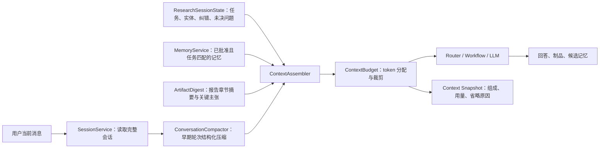

# Memory and Context Foundation V1 Implementation Plan

> **For Claude:** REQUIRED SUB-SKILL: Use superpowers:executing-plans to implement this plan task-by-task.

**Goal:** 建立服务端权威、token 可预算、可压缩、可审计的四层记忆与对话上下文系统，并用论点更新/事实纠错工作流完成真实验收。

**Architecture:** 保持现有 React + Express + Python + SQLite 的模块化单体，不引入新的数据库或消息中间件。`chat_messages` 保存原始会话，`research_session_state` 保存当前工作状态，`memory_items` 保存受治理长期记忆；新的 `ContextAssembler` 只负责按任务选择和组装，不复制存储。所有模型调用统一消费一个 `AssembledContext`，前端不再通过字符截断决定模型上下文。

**Tech Stack:** Node.js ESM、Express、better-sqlite3、@dqbd/tiktoken、Python 3、React/TypeScript、Node test、Pytest、Vitest。

---

## 0. 本阶段边界

### 本阶段要做

- 冻结当前个股深度研究 V3 的绿色基线；
- 统一会话、用户偏好、研究事实/论点、分析框架四层记忆；
- 建立 token 预算、上下文压缩、固定事实和制品摘要机制；
- 保存每次模型调用的上下文快照；
- 用 `thesis_update + claim_correction` 验证真实多轮连续性。

### 本阶段不做

- 不同时重写全部既有工作流；
- 不引入 Redis、Postgres、独立向量数据库或分布式任务系统；
- 不自动批准研究记忆；
- 不让摘要替代原始消息、正式证据或完整 artifact；
- 不把运行日志、阶段状态和系统元数据混入研究正文。

## 1. 目标数据流



## 2. 四层记忆用途

| 层 | 权威存储 | 自动写入 | 能否作为事实 | 生命周期 |
|---|---|---:|---:|---|
| 会话工作记忆 | `research_session_state` | 可以 | 仅其中带证据的 confirmed facts | 当前会话/任务 |
| 用户偏好 | `memory_items` | 仅用户明确表达后生成候选 | 否，作为输出约束 | 跨会话 |
| 研究事实/论点 | `memory_items` + evidence links | 只能生成 candidate | approved 后可以 | 按实体、版本和有效期 |
| 分析框架 | `memory_items` | 只能生成 candidate | 否，只作为方法 | 跨实体复用 |

## Task 0：冻结当前绿色基线

**Files:**
- Modify: `.gitignore`
- Verify: `legacy_manifest/inventory.json`
- Verify: `legacy_manifest/classifications.csv`

**Step 1: 明确排除运行产物**

在 `.gitignore` 中将整个 `06_outputs/` 视为运行产物；保留经过人工选择的 `artifacts_golden/` 作为小型测试夹具。

**Step 2: 运行完整质量门**

Run:

```powershell
npm run check:full
```

Expected: Python workflow、research/E2E、self-discovery、Express API、UI 和仓库清单全部通过。

**Step 3: 检查空白、密钥与待提交清单**

Run:

```powershell
git diff --check
git status --short
git diff --cached --name-only
```

Expected:

- `.env`、数据库、日志、`06_outputs/` 不在暂存区；
- `.env.example` 只含占位符；
- `artifacts_golden/` 只含脱敏、体积受控的验收夹具；
- 暂存文件与 `legacy_manifest` 一致。

**Step 4: 创建本地冻结提交**

Run:

```powershell
git commit -m "feat(mvp): freeze governed research workflows and live workbench"
```

Expected: 生成一个可回退 checkpoint。只有用户明确确认后才执行 `git push origin refactor/personal-research-mvp`。

## Task 1：先写上下文行为测试

**Files:**
- Create: `tests/api/context-budget.test.js`
- Create: `tests/api/context-assembler.test.js`
- Create: `tests/api/conversation-compactor.test.js`
- Create: `tests/api/memory-retrieval-policy.test.js`
- Create: `tests/e2e/test_memory_context_long_conversation.py`

**Step 1: 写当前应失败的核心测试**

覆盖以下行为：

```js
test("user correction is pinned ahead of stale summaries");
test("candidate memory never enters factual context");
test("artifact body is replaced by digest and reference");
test("assembled context never exceeds the configured token budget");
test("omitted sections are recorded with reasons");
test("server reloads full history by sessionId instead of trusting client truncation");
```

**Step 2: 写跨语言长会话验收样例**

构造至少 24 轮会话，包含：

- 同一标的连续追问；
- “继续”“第二个呢”等省略表达；
- 用户纠正一个核心数值；
- 页面刷新后继续；
- 新会话查询同一标的；
- 候选记忆与已批准记忆同时存在。

**Step 3: 运行并确认失败**

Run:

```powershell
node --test --test-concurrency=1 tests/api/context-*.test.js tests/api/conversation-compactor.test.js tests/api/memory-retrieval-policy.test.js
python -m pytest tests/e2e/test_memory_context_long_conversation.py -q
```

Expected: FAIL，原因是新服务和统一契约尚不存在，而不是测试环境错误。

**Step 4: Commit**

```powershell
git add tests/api/context-budget.test.js tests/api/context-assembler.test.js tests/api/conversation-compactor.test.js tests/api/memory-retrieval-policy.test.js tests/e2e/test_memory_context_long_conversation.py
git commit -m "test(context): define long-conversation memory contracts"
```

## Task 2：实现统一 token 预算

**Files:**
- Create: `api/services/context-tokenizer.js`
- Create: `api/services/context-budget.js`
- Modify: `.env.example`
- Test: `tests/api/context-budget.test.js`

**Step 1: 定义预算契约**

```js
{
  maxInputTokens: 32000,
  reserveOutputTokens: 8000,
  sections: {
    system: 3500,
    task: 2500,
    pinned: 4000,
    recentTurns: 6000,
    compactedHistory: 3500,
    approvedMemory: 4500,
    artifactDigests: 2500
  }
}
```

`LLM_CONTEXT_MAX_INPUT_TOKENS` 和 `LLM_CONTEXT_OUTPUT_RESERVE_TOKENS` 可覆盖默认值。预算器必须按 token 计数，不能再用 `substring()` 作为主策略。

**Step 2: 实现确定性裁剪**

裁剪顺序从低到高：

1. 低相关度分析框架；
2. 较旧 artifact digest；
3. 较旧 approved memory；
4. compacted history；
5. recent turns。

`pinned` 中的用户纠错、当前实体、已核验事实和未决问题不可被静默裁剪；若固定信息本身超限，返回显式错误。

**Step 3: 运行聚焦测试**

Run:

```powershell
node --test tests/api/context-budget.test.js
```

Expected: PASS。

**Step 4: Commit**

```powershell
git add api/services/context-tokenizer.js api/services/context-budget.js .env.example tests/api/context-budget.test.js
git commit -m "feat(context): add token-aware context budgeting"
```

## Task 3：实现会话压缩与上下文快照

**Files:**
- Create: `api/services/conversation-compactor.js`
- Create: `api/services/context-snapshot-repository.js`
- Create: `migrations/0013_context_snapshots.sql`
- Modify: `tests/runtime/test_migrations.py`
- Test: `tests/api/conversation-compactor.test.js`

**Step 1: 增加快照表**

```sql
CREATE TABLE IF NOT EXISTS context_snapshots (
    snapshot_id TEXT PRIMARY KEY,
    session_id TEXT NOT NULL,
    turn_id TEXT,
    task_id TEXT,
    context_json TEXT NOT NULL,
    token_usage_json TEXT NOT NULL,
    omitted_json TEXT NOT NULL DEFAULT '[]',
    created_at TEXT NOT NULL
);

CREATE INDEX IF NOT EXISTS idx_context_snapshots_session_time
ON context_snapshots(session_id, created_at DESC);
```

**Step 2: 实现结构化压缩**

压缩结果固定包含：

```js
{
  entities: [],
  userGoals: [],
  confirmedFacts: [],
  temporaryAssumptions: [],
  userCorrections: [],
  decisions: [],
  unresolvedQuestions: [],
  artifactRefs: [],
  coveredMessageIds: []
}
```

LLM 不可用或输出无效时，使用确定性抽取降级。压缩结果只进入会话工作记忆，不能直接写入正式研究事实。

**Step 3: 保留最近原文**

默认保留最近 4 个完整 user/assistant turn；更早消息压缩。重复压缩必须以 `coveredMessageIds` 防止内容叠加和摘要漂移。

**Step 4: 测试与提交**

Run:

```powershell
node --test tests/api/conversation-compactor.test.js
python -m pytest tests/runtime/test_migrations.py -q
```

Expected: PASS。

```powershell
git add api/services/conversation-compactor.js api/services/context-snapshot-repository.js migrations/0013_context_snapshots.sql tests/api/conversation-compactor.test.js tests/runtime/test_migrations.py
git commit -m "feat(context): compact conversations and persist context snapshots"
```

## Task 4：统一长期记忆检索政策

**Files:**
- Create: `api/services/memory-retrieval-policy.js`
- Modify: `api/services/memory-service.js`
- Modify: `smr_app/adapters/memory.py`
- Test: `tests/api/memory-retrieval-policy.test.js`
- Test: `tests/test_unified_memory_phase12.py`

**Step 1: 按用途隔离四层记忆**

检索返回统一结构：

```js
{
  memoryId,
  memoryType,
  entityId,
  content,
  status,
  asOf,
  evidenceIds,
  relevance,
  allowedUsage,
  retrievalReason,
  conflictFlag
}
```

`allowedUsage` 只能为：

- `factual_context`
- `method_context`
- `preference_constraint`
- `review_only`

**Step 2: 强制治理规则**

- 只有 `approved` 且证据/有效期满足要求的事实记忆可以是 `factual_context`；
- 分析框架只能是 `method_context`；
- candidate/rejected/archived/conflict 均为 `review_only` 或不返回；
- 每次实际使用调用现有 `recordRetrieval()`，记录原因、消费者和用途；
- 明确用户偏好必须带 `preference_source=user_explicit`。

**Step 3: 测试冲突和隔离**

Run:

```powershell
node --test tests/api/memory-retrieval-policy.test.js
python -m pytest tests/test_unified_memory_phase12.py -q
```

Expected: PASS，候选记忆用于事实判断的断言次数为 0。

**Step 4: Commit**

```powershell
git add api/services/memory-retrieval-policy.js api/services/memory-service.js smr_app/adapters/memory.py tests/api/memory-retrieval-policy.test.js tests/test_unified_memory_phase12.py
git commit -m "feat(memory): enforce governed four-layer retrieval"
```

## Task 5：实现统一 ContextAssembler

**Files:**
- Create: `api/services/context-assembler.js`
- Modify: `api/services/session-service.js`
- Modify: `api/services/research-session-state.js`
- Test: `tests/api/context-assembler.test.js`

**Step 1: 定义唯一输入**

```js
assemble({
  sessionId,
  currentMessage,
  taskEnvelope,
  sessionState,
  approvedMemories,
  artifactDigests,
  modelProfile
})
```

输出：

```js
{
  sections,
  messages,
  tokenUsage,
  omitted,
  snapshotId
}
```

**Step 2: 服务端读取权威历史**

通过 `SessionService.getSessionMessages(sessionId)` 读取消息。客户端传来的 `conversationContext.chatHistory` 在过渡期只作兼容回退，并记录 `legacy_client_context=true`，不得覆盖服务端历史。

**Step 3: 固定信息优先**

以下内容进入 `pinned`：

- 当前任务和实体；
- 用户纠错；
- 有 evidence ID 的 confirmed facts；
- 当前未决问题；
- 最近 artifact 引用。

**Step 4: 测试与提交**

Run:

```powershell
node --test tests/api/context-assembler.test.js
```

Expected: PASS。

```powershell
git add api/services/context-assembler.js api/services/session-service.js api/services/research-session-state.js tests/api/context-assembler.test.js
git commit -m "feat(context): assemble server-authoritative research context"
```

## Task 6：接入路由、工作流和模型网关

**Files:**
- Modify: `api/services/chat-enhanced-service.js`
- Modify: `api/services/conversation-task-router-v2.js`
- Modify: `api/services/workflow-engine.js`
- Modify: `api/services/llm-service.js`
- Modify: `src/features/chat/ChatPanel.tsx`
- Test: `tests/api/chat-api-session-integration.test.js`
- Test: `tests/api/conversation-task-router-v2.test.js`
- Test: `tests/api/research-session-e2e.test.js`
- Test: `src/features/chat/__tests__/ChatPanel.test.tsx`

**Step 1: 在一次请求中只组装一次上下文**

`chat-enhanced-service` 创建 `AssembledContext`，路由器、WorkflowEngine 和最终 LLM 调用读取同一个快照，不再各自 `slice()`/`substring()`。

**Step 2: 移除前端上下文裁剪职责**

`ChatPanel` 只发送：

```ts
{
  message,
  sessionId
}
```

保留旧字段的后端兼容期，但新增请求不再发送最近 10 条截断历史。

**Step 3: 区分上下文用途**

- Router 只读取任务、实体、最近用户意图和必要纠错；
- Workflow 读取任务契约、已核验事实、相关记忆和 artifact digest；
- 报告综合读取 Evidence Packet，不把聊天噪声注入报告正文。

**Step 4: 运行集成测试**

Run:

```powershell
node --test --test-concurrency=1 tests/api/chat-api-session-integration.test.js tests/api/conversation-task-router-v2.test.js tests/api/research-session-e2e.test.js
npx vitest run src/features/chat/__tests__/ChatPanel.test.tsx --maxWorkers=1 --no-file-parallelism
```

Expected: PASS。

**Step 5: Commit**

```powershell
git add api/services/chat-enhanced-service.js api/services/conversation-task-router-v2.js api/services/workflow-engine.js api/services/llm-service.js src/features/chat/ChatPanel.tsx tests/api/chat-api-session-integration.test.js tests/api/conversation-task-router-v2.test.js tests/api/research-session-e2e.test.js src/features/chat/__tests__/ChatPanel.test.tsx
git commit -m "feat(agent): use unified context across routing and workflows"
```

## Task 7：增加上下文诊断入口

**Files:**
- Create: `api/routes/context.js`
- Create: `src/features/chat/ContextInspector.tsx`
- Modify: `api/app.js`
- Modify: `src/features/chat/ChatPanel.tsx`
- Test: `tests/api/context-routes.test.js`
- Test: `src/features/chat/__tests__/ContextInspector.test.tsx`

**Step 1: 提供只读诊断 API**

`GET /api/context/snapshots/:snapshotId` 返回：

- 各分区 token 用量；
- 使用的 memory/artifact ID；
- 省略内容的类型和原因；
- 是否发生降级或压缩。

不得返回 API key、cookie、授权头或完整第三方原始响应。

**Step 2: 前台默认折叠**

研究回答下提供“本轮上下文”入口，默认不展示系统细节；展开后用于自查，不混入报告正文。

**Step 3: 测试与提交**

Run:

```powershell
node --test tests/api/context-routes.test.js
npx vitest run src/features/chat/__tests__/ContextInspector.test.tsx --maxWorkers=1 --no-file-parallelism
```

Expected: PASS。

```powershell
git add api/routes/context.js src/features/chat/ContextInspector.tsx api/app.js src/features/chat/ChatPanel.tsx tests/api/context-routes.test.js src/features/chat/__tests__/ContextInspector.test.tsx
git commit -m "feat(workbench): expose auditable context diagnostics"
```

## Task 8：用论点更新和事实纠错完成真实验收

**Files:**
- Modify: `smr_app/workflows/claim_correction.py`
- Create: `smr_app/workflows/thesis_update.py`
- Modify: `smr_app/runtime/registry.py`
- Test: `tests/workflows/test_claim_correction_workflow.py`
- Modify: `tests/workflows/test_thesis_update.py`
- Modify: `config/conversation_replay_eval.json`
- Modify: `tools/evaluate_conversation_workflows.py`

**Step 1: 固化真实连续会话**

至少包含：

1. 对某标的生成深度研究；
2. 追问其中一个经营驱动；
3. 要求基于新公告更新论点；
4. 用户纠正一个数值；
5. 系统重新获取权威数据；
6. 所有依赖结论重算；
7. 页面刷新后继续；
8. 新会话中召回已批准论点，不召回候选论点。

**Step 2: 验收产物**

- `thesis_update` 输出 old/new/diff、证据变化、结论变化和待验证项；
- `claim_correction` 输出原值、用户主张、权威复核值、依赖主张重算结果；
- 正文不出现 run ID、阶段计数、模型状态或数据管线日志；
- 每个核心事实有证据，计算可复算。

**Step 3: 运行真实 Minimax 测试**

Run:

```powershell
python tools/evaluate_conversation_workflows.py final --no-mock
npm run check:full
```

Expected:

- 24+ 轮上下文连续性门通过；
- 核心数值事实错误为 0；
- 候选记忆进入事实判断为 0；
- 纠错后遗漏下游重算为 0；
- token 超限和静默截断为 0；
- 完整质量门通过。

**Step 4: Commit**

```powershell
git add smr_app/workflows/claim_correction.py smr_app/workflows/thesis_update.py smr_app/runtime/registry.py tests/workflows/test_claim_correction_workflow.py tests/workflows/test_thesis_update.py config/conversation_replay_eval.json tools/evaluate_conversation_workflows.py
git commit -m "feat(research): validate memory context with thesis updates"
```

## 3. 本阶段总验收门

必须全部满足：

1. 24 轮长会话无实体、任务、纠错和未决问题丢失；
2. 刷新页面后的追问与刷新前一致；
3. 上下文由服务端权威组装，前端不再截断历史；
4. 所有模型调用在配置 token 预算内；
5. 用户纠错和已核验事实不会被摘要覆盖；
6. candidate/rejected/archived/conflict 记忆用于事实判断次数为 0；
7. 每条被使用记忆都有 retrieval reason 和 consumer；
8. 报告正文不混入上下文诊断与运行状态；
9. 删除会话不删除正式研究记忆；
10. 模型或压缩失败时可降级，且不会生成伪精确事实；
11. `npm run check:full` 全绿；
12. 至少一条真实 `thesis_update + claim_correction` 连续链质量达标。

## 4. 后续工作流顺序

只有上述 12 个门全部通过后，才按以下顺序逐条打磨：

1. **公告/财报事件解读 V1**：输入公告或公司，输出事实变化、经营影响、估值变量和旧论点变化；
2. **每日研究简报 V1**：只覆盖关注标的和已批准论点，避免泛资讯堆砌；
3. **组合复盘 V1**：结合持仓、约束、风险暴露和新证据，不直接执行交易；
4. **同行比较/估值 V2**：复用经营驱动估值和统一 peer set；
5. 其余低频工作流按真实使用频率决定，不以工作流数量为目标。
